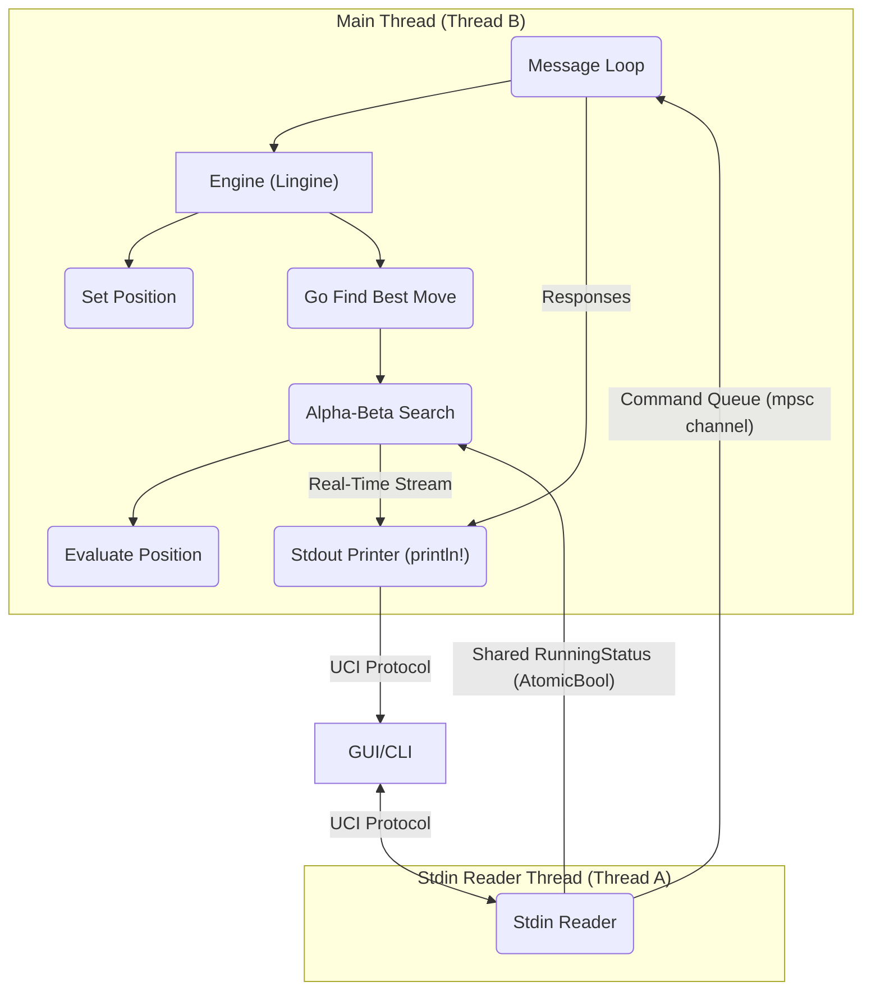
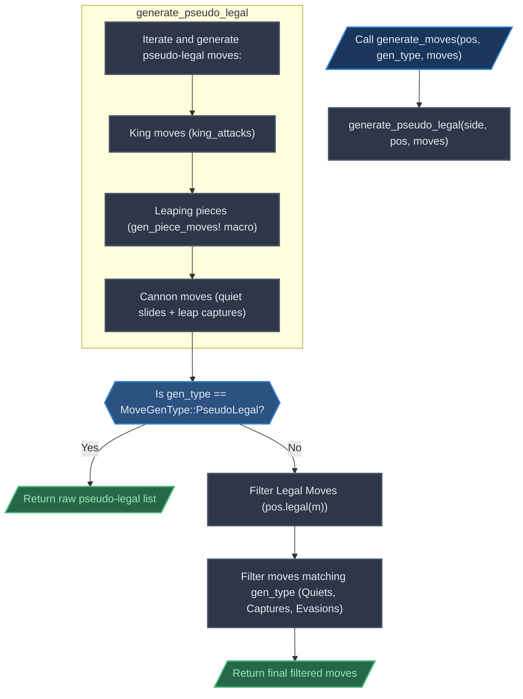
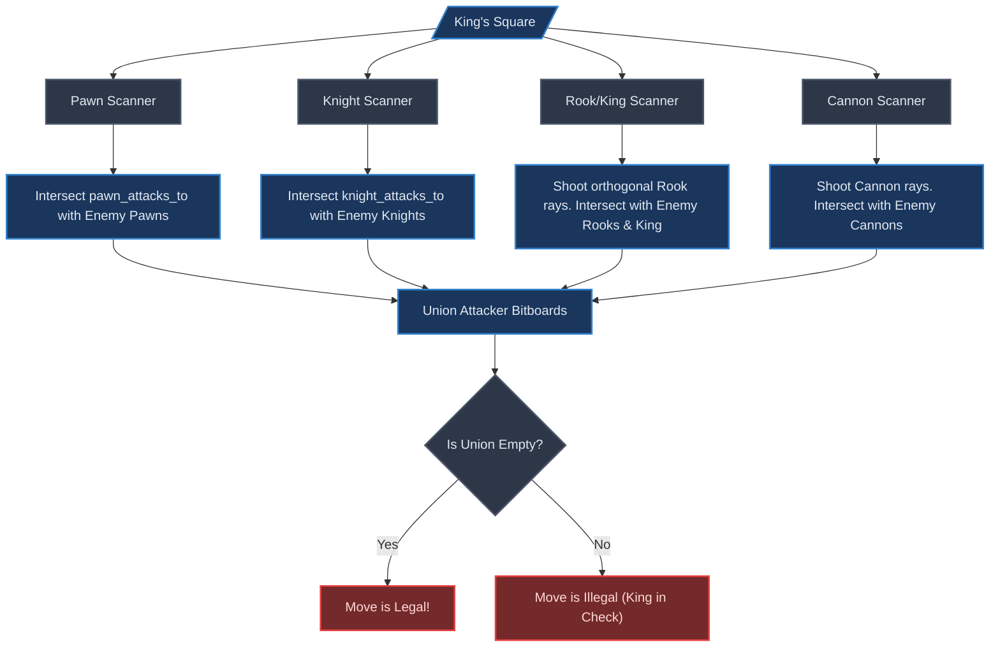
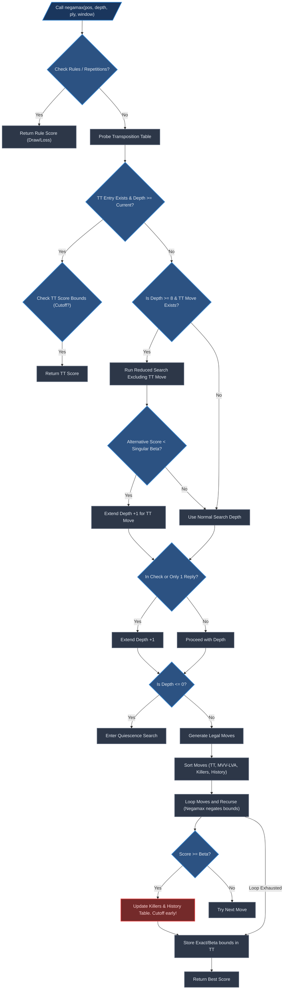
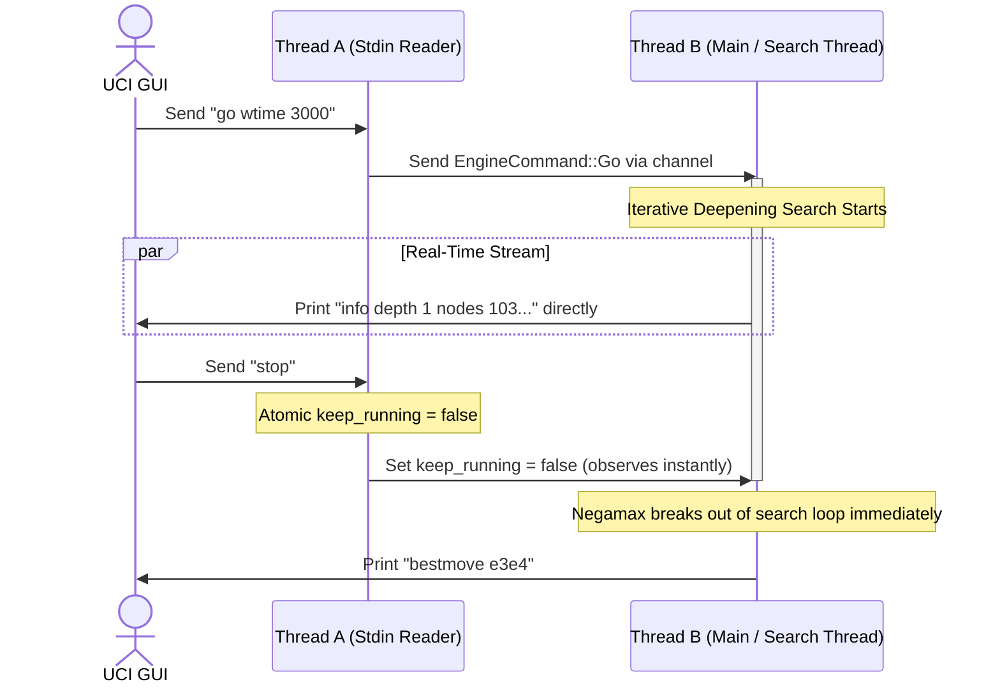

# How Lingine works

This document explains how Lingine works under the hood.

## System Architecture Overview

The global architecture is represented by the diagram below.



## State representation

### Definition

The state $S$ of a Xiangqi game can be defined as:

$$S = \langle B, p, c_h, h \rangle $$

where,

- $B$ (Board) is a $10 \times 9$ grid of squares, where each square can either
  be empty or house a piece from the 14 available piece types (7 for each side).
- $p$ (Player/Side) is the side who is allowed to move next, can be either Red
  or Black.
- $c_h$ (Count Half-move) is the number of plys (half-moves) that tracks the
  60-move rule, which increments on every non-capturing move and resets to 0
  immediately upon any piece capture.
- $h$ (History) is the chronological sequence of all moves performed up until
  the current ply, used to detect illegal repetitions and perpetual checks.

### How Lingine represents it

Inside [position/mod.rs](src/core/position/mod.rs) you can find how we represent
a position. Specifically,

```rust
#[derive(Clone)]
pub struct Position {
    /// Flat 90-square array mapping square index (0 to 89) to the Piece
    /// occupying it.
    board: [Option<Piece>; Square::COUNT],
    /// Precomputed bitboards showing piece placements grouped by `PieceType`.
    bitboard_by_type: [Bitboard; PieceType::COUNT],
    /// Precomputed bitboards showing piece placements grouped by `Side`.
    bitboard_by_color: [Bitboard; Side::COUNT],

    /// Active count of each piece category on the board.
    piece_count: [u8; Piece::COUNT],
    /// Current state of position
    state: StateInfo,
    /// Stack tracking previous move parameter histories for undoing moves.
    history: Vec<StateInfo>,
    /// Total moves played in the game so far (Red = 0, Black = 1, Red's
    /// next = 2, etc.).
    game_ply: u16,
    /// Palace coordinates of both sides' Generals (Kings) for faster check
    /// detection.
    king_squares: [Square; Side::COUNT],
}
```

The `StateInfo` struct holds additional information for each move made in the
game. Specifically,

```rust
#[derive(Clone, Copy, Debug)]
struct StateInfo {
    /// The last move played to reach this state.
    pub last_move: Option<Move>,
    /// The piece captured during this move, or `None` if it was quiet.
    pub captured_piece: Option<Piece>,
    /// The prior Zobrist position hash value before the move occurred.
    pub zobrist: u64,
    /// Halfmove clock / 60-rule counter (increments on quiet moves, resets to 0
    /// on captures/pawn moves).
    pub sixtymove_clock: u16,
    /// Whether the side to move was in check in this position state.
    pub in_check: bool,
    /// Precalculated incremental mid- and end-game score (from Red's
    /// perspective)
    pub score: PackedScore,
    /// Precalculated incremental game phase
    pub phase: u8,
    /// Checker pieces checking the King of the side to move.
    pub checkers: Bitboard,
    /// Pinned pieces (blockers) for both sides' kings.
    pub blockers_for_king: [Bitboard; Side::COUNT],
    /// The slider pieces pinning other pieces for both sides' kings.
    pub pinners: [Bitboard; Side::COUNT],
    /// Check squares for each piece type of the side to move (against the
    /// opponent king).
    pub check_squares: [Bitboard; PieceType::COUNT],
    /// Whether we need a full check validation.
    pub need_full_check: bool,
    /// Number of plies played since the last null move.
    pub plies_since_null: u16,
}
```

### Zobrist Hash Signature

To quickly identify unique board states and detect repetitions, Lingine computes
a 64-bit Zobrist hash signature of the position (`zobrist` in `StateInfo`).

At compile-time, a deterministic pseudo-random key is generated for every piece
type on every one of the 90 squares, as well as a key representing the
side-to-move. These keys are initialized using a Linear Congruential Generator
(LCG) seeded with the combined student IDs of the developers:

$$\text{SEED} = 202416124 \oplus 202400076 \oplus 2416167$$

Position hashes are updated incrementally during `do_move` and `undo_move` using
fast bitwise XOR operations:

$$\text{hash}_{\text{new}} = \text{hash}_{\text{old}} \oplus \text{ZOBRIST.pieces}[\text{piece}][\text{from}] \oplus \text{ZOBRIST.pieces}[\text{piece}][\text{to}] \oplus \text{ZOBRIST.side}$$

If a piece is captured, its key is also XOR'ed out of the hash. This incremental
approach eliminates the need to recalculate the hash from scratch, ensuring
$O(1)$ updates.

## Move generation

The move generation process can be visualized like this:



### Static lookup tables

Since we represent our boards as bitboards, we can calculate attack paths at
compile-time using static lookup tables and precomputed magic numbers.

```rust
pub(super) static KING_ATTACKS: [Bitboard; Square::COUNT] = init_king_attacks();
pub(super) static ADVISOR_ATTACKS: [Bitboard; Square::COUNT] = init_advisor_attacks();
pub(super) static PAWN_ATTACKS: [[Bitboard; Square::COUNT]; Side::COUNT] = init_pawn_attacks();
pub(super) static PAWN_ATTACKS_TO: [[Bitboard; Square::COUNT]; 2] = init_pawn_attacks_to();
pub(super) static RANK_TABLE: [RankEntry; File::COUNT] = init_rank_table();
pub(super) static FILE_TABLE: [FileEntry; Rank::COUNT] = init_file_table();
pub(super) static FILE_ATTACKS_BY_MASK: [[Bitboard; 1 << Rank::COUNT]; 9] = init_file_attacks_by_mask();

// Magic bitboard multipliers for blockable leapers
pub(super) static KNIGHT_MAGICS: [Magic<16>; Square::COUNT] =
    build_magics::<16, 4>(LeaperType::Knight, KNIGHT_DIRS.0, KNIGHT_DIRS.1);
pub(super) static BISHOP_MAGICS: [Magic<16>; Square::COUNT] =
    build_magics::<16, 4>(LeaperType::Bishop, BISHOP_DIRS.0, BISHOP_DIRS.1);
pub(super) static KNIGHT_TO_MAGICS: [Magic<16>; Square::COUNT] =
    build_magics::<16, 4>(LeaperType::KnightTo, BISHOP_DIRS.0, BISHOP_DIRS.1);
```

### Pseudo-Legal Move Generation

Move generation in Lingine is designed to be highly optimized and entirely
heap-allocation free. All moves are accumulated into an `ArrayVec<Move, 128>`
stack-allocated structure (`MoveList`), eliminating memory allocation overhead
in performance-critical search paths. The generation divides pieces into three
distinct categories based on their movement patterns and blockability:
unblockable leaping pieces, blockable leaping pieces, and sliding pieces.

All pseudo-legal moves are generated in a single pass in
`generate_pseudo_legal`:

```rust
fn generate_pseudo_legal(side: Side, pos: &Position, moves: &mut MoveList) {
    let us = side;
    let them = us.opposite();
    let us_pieces = pos.bitboard_by_color(us);
    let them_pieces = pos.bitboard_by_color(them);
    let occupied = pos.bitboard_occupied();

    macro_rules! gen_piece_moves {
        ($type:expr, |$from:ident| $targets:expr) => {
            let mut pieces = pos.bitboard_by_type($type) & us_pieces;
            while let Some($from) = pieces.pop_lsb() {
                let mut targets = $targets;
                while let Some(to_sq) = targets.pop_lsb() {
                    moves.push(Move::new($from, to_sq));
                }
            }
        };
    }

    // 1. King
    let king_sq = pos.king_square(us);
    let mut king_targets = king_attacks(king_sq) & !us_pieces;
    while let Some(to_sq) = king_targets.pop_lsb() {
        moves.push(Move::new(king_sq, to_sq));
    }

    // 2. Leapers
    gen_piece_moves!(PieceType::Advisor, |from| {
        advisor_attacks(from) & !us_pieces
    });
    gen_piece_moves!(PieceType::Bishop, |from| {
        bishop_attacks(from, occupied) & !us_pieces
    });
    gen_piece_moves!(PieceType::Knight, |from| {
        knight_attacks(from, occupied) & !us_pieces
    });
    gen_piece_moves!(PieceType::Pawn, |from| {
        pawn_attacks(from, us) & !us_pieces
    });
    gen_piece_moves!(PieceType::Rook, |from| {
        rook_attacks(from, occupied) & !us_pieces
    });
    gen_piece_moves!(PieceType::Cannon, |from| {
        // Cannon moves consist of:
        // - Quiet slides: Moves along empty squares, identical to Rook attacks but restricted to unoccupied squares.
        // - Leap captures: Captures that jump over exactly one piece and land on an opponent piece.
        (rook_attacks(from, occupied) & !occupied) | (cannon_captures(from, occupied) & them_pieces)
    });
}
```

#### 1. Leaping Pieces (King, Advisor, Pawn)

For pieces that do not have their paths obstructed by intermediate pieces, the
valid destination squares are computed by querying static, pre-calculated lookup
tables and masking out squares occupied by friendly pieces.

- **King (General)**: confined to the $3 \times 3$ Palace. It moves exactly 1
  step orthogonally:
  $$\text{King Attacks} = \text{king\_attacks}(\text{from\_sq}) \cap \neg \text{us\_pieces}$$
- **Advisor**: confined to the diagonal paths within the Palace (yielding
  exactly 5 valid squares on the board). It moves exactly 1 step diagonally:
  $$\text{Advisor Attacks} = \text{advisor\_attacks}(\text{from\_sq}) \cap \neg \text{us\_pieces}$$
- **Pawn (Soldier)**: Its movement rules change dynamically based on whether it
  has crossed the river separating the two territories:
  - **Unpromoted (own side)**: Can only move exactly 1 step straight forward.
  - **Promoted (crossed river)**: Can move 1 step forward OR 1 step horizontally
    (left/right).

  A Red Pawn is promoted when its rank index is $\ge 5$, while a Black Pawn is
  promoted when its rank index is $\le 4$. The attack mask is retrieved
  instantly:
  $$\text{Pawn Attacks} = \text{pawn\_attacks}(\text{from\_sq}, \text{us}) \cap \neg \text{us\_pieces}$$

#### 2. Blockable Leaping Pieces (Bishop, Knight)

For leaping pieces that can be blocked by intermediate pieces, the engine uses a
fast bitwise indexing strategy utilizing precomputed magic tables in $O(1)$
time.

- **Bishop (Elephant)**: Moves exactly 2 steps diagonally and cannot cross the
  river. It is blocked if there is any piece occupying the intermediate diagonal
  square (referred to as the "Bishop's eye" or elbow).
- **Knight (Horse)**: Moves in an L-shape (1 step orthogonally followed by 1
  step diagonally outward). It is blocked if there is any piece occupying the
  adjacent orthogonal square (the "Horse leg").

Instead of checking blockers manually in a loop, the precalculated
`KNIGHT_MAGICS`, `BISHOP_MAGICS`, and `KNIGHT_TO_MAGICS` lookups resolve the
moves using magic bitboards. The blocking squares are masked, multiplied by a
magic number, and shifted to yield a direct index into the attack table:

$$\text{index} = \frac{(\text{occupied} \cap \text{mask}) \times \text{magic}}{2^{128 - \text{log}_2(\text{SIZE})}}$$

$$\text{Attacks} = \text{attacks}[\text{index}] \cap \neg \text{us\_pieces}$$

#### 3. Sliding Pieces (Rook, Cannon)

Sliding pieces (Chariot and Cannon) present a unique challenge due to their
long-range movement. Lingine optimizes this by handling rank-based (horizontal)
and file-based (vertical) sliding attacks separately:

##### Horizontal Rank Extraction

Since a rank consists of 9 contiguous squares in a rank-major $10 \times 9$
layout, we can extract the 9-bit occupancy state of rank $r$ instantly by
shifting the raw 128-bit board value and masking the lowest 9 bits:
$$\text{rank\_occ} = (\text{occupied.raw()} \gg (r \times 9)) \ \& \ 0x1\text{FF}$$
The horizontal attacks are queried directly in $O(1)$ via the precomputed
`RANK_TABLE[file].rook_slides[rank_occ]`.

##### Vertical File Extraction via Magic Multiplication

Because file squares are spaced exactly 9 bits apart, gathering them into a
contiguous index is highly expensive in a standard loop. Lingine resolves this
by performing **Magic Multiplication** inside `gather_file_bits`:

1. Shift the raw bitboard value right by the file index $f$.
2. Split the resulting bits into two 64-bit halves: `low` (bottom 5 ranks) and
   `high` (top 5 ranks).
3. Mask each half using `0x10_0804_0201` to isolate the 5 bits spaced at 9-bit
   intervals.
4. Multiply each masked value by the magic constant `0x1010101010` which
   mathematically shifts and sums the spaced bits, aligning them into a
   contiguous 5-bit block starting at bit 36.
5. Shift down by 36 and mask the lowest 5 bits (`& 0x1F`) to obtain clean
   indices `key_low` and `key_high`.
6. Combine both keys to form a 10-bit vertical occupancy index:
   $$\text{file\_occ} = \text{key\_low} \ | \ (\text{key\_high} \ll 5)$$

Using this 10-bit vertical index, the file attack mask is retrieved in $O(1)$
from `FILE_TABLE[rank].rook_slides[file_occ]`. This mask is mapped back to a
full vertical `Bitboard` using the precalculated static matrix
`FILE_ATTACKS_BY_MASK[file][file_attack_mask]`.

```rust
const fn gather_file_bits(bits: u128, f: usize) -> usize {
    let occ = bits >> f;
    const STEP_MASK: u64 = 0x10_0804_0201;
    const MAGIC_MULTIPLIER: u64 = 0x1010101010;
    let low = (occ as u64 & STEP_MASK).wrapping_mul(MAGIC_MULTIPLIER) >> 36;
    let high = ((occ >> 45) as u64 & STEP_MASK).wrapping_mul(MAGIC_MULTIPLIER) >> 36;
    ((low & 0x1F) | ((high & 0x1F) << 5)) as usize
}
```

##### Cannon Attack Mechanics

Cannons move quiet like Rooks but capture by leaping over exactly one piece (the
"hurdle" or "screen"). We leverage the same horizontal and vertical occupancy
indices, but split their moves into quiet slides and leap captures:

- **Quiet Moves**: The same table lookups are used, but we filter out occupied
  squares using a bitwise AND:
  $$\text{quiet\_moves} = \text{rook\_attacks} \cap \neg \text{occupied}$$
- **Leap Captures**: Probes the precalculated Cannon table and intersects the
  results with the opponent's pieces:
  $$\text{captures} = \text{cannon\_captures} \cap \text{them\_pieces}$$
- The final attack set is the union of quiet moves and leap captures:
  $$\text{Cannon Attacks} = \text{quiet\_moves} \cup \text{captures}$$

---

### The Backward Attack Scanner ($O(1)$ Checker Detection)

To verify if a move is legal, we must ensure that it does not leave our King in
check. Generating the entire list of opponent moves to check for attacks is
computationally expensive. Lingine avoids this entirely by implementing a
loopless, high-performance **Backward Attack Scanner** in `checkers_to`.

Instead of checking which opponent pieces can attack the King, the scanner
shoots virtual "rays" and "leaps" outward from the King's square to detect any
enemy pieces that could strike the King. This reverses the attack logic in
$O(1)$ time:



1. **Pawn Scanner**: Probes the reverse pawn attack table
   `pawn_attacks_to(square, attacker)` and intersects it with enemy Pawn
   locations.
2. **Knight Scanner**: Probes `knight_attacks_to(square, occupied)` and
   intersects it with enemy Knights.
3. **Rook & King Scanner**: Traces orthogonal sliding rays from the King's
   square using Rook sliding logic. Intersects with enemy Rooks and the enemy
   King. This naturally implements the **Flying General** rule where two Kings
   facing each other on an open file counts as an illegal check (treated as a
   virtual Rook attack).
4. **Cannon Scanner**: Traces Cannon rays outward from the King's square using
   Cannon sliding logic, finding all squares that have exactly one piece between
   them and the King, and intersects them with enemy Cannons.

```rust
pub(super) fn checkers_to(
    &self,
    square: Square,
    occupied: Bitboard,
    attacker: Side,
) -> Bitboard {
    let pawns = self.bitboard_by_type(PieceType::Pawn);
    let knights = self.bitboard_by_type(PieceType::Knight);
    let rooks = self.bitboard_by_type(PieceType::Rook);
    let cannons = self.bitboard_by_type(PieceType::Cannon);
    let king = self.bitboard_by_type(PieceType::King);
    let pawn_attackers = pawn_attacks_to(square, attacker) & pawns;
    let knight_attackers = knight_attacks_to(square, occupied) & knights;
    // Intersect with Rooks AND the King: under the Flying General rule, two Kings
    // facing each other on an open file counts as a check (treated as a
    // Rook attack).
    let rook_attackers = rook_attacks(square, occupied) & (rooks | king);
    let cannon_attackers = cannon_captures(square, occupied) & cannons;

    (pawn_attackers | knight_attackers | rook_attackers | cannon_attackers)
        & self.bitboard_by_color(attacker)
}
```

---

### Move Legality Verification

The primary entry point `generate_moves` orchestrates move generation and
filters out illegal moves using the following flow:

1. **Generate Pseudo-Legal Moves**: The piece generators are executed in
   sequence, pushing their moves to the stack-allocated `MoveList`.
2. **Filter by MoveGenType**: If the caller requested
   `MoveGenType::PseudoLegal`, the raw count is returned immediately with zero
   overhead. Otherwise, the engine iterates over the moves and validates their
   legality:

   ```rust
   pub fn legal(&self, m: Move) -> bool {
       let us = self.side_to_move();
       let from = m.from();
       let to = m.to();
       let moved_piece =
           self.board[from].expect("No piece at the source square for legality check");
       let pt = moved_piece.piece_type();

       let occupied = (self.bitboard_occupied() ^ Bitboard::from(from)) | Bitboard::from(to);

       // If the moving piece is a King, check whether the destination square is
       // attacked by opponent
       if pt == PieceType::King {
           return self.checkers_to(to, occupied, us.opposite()).is_empty();
       }

       // If we don't need full check, the move is legal under the fast path:
       if !self.state.need_full_check {
           // A non-king move is legal if the piece is not pinned (blocker) OR:
           // - it is not a Cannon, or it is a Cannon but not a capture move
           // - and the move is aligned with the King
           if !self.state.blockers_for_king[us].contains(from)
               || ((pt != PieceType::Cannon || !self.is_capture(m))
                   && self.aligned(from, to, self.king_square(us)))
           {
               return true;
           }
       }

       // Otherwise, run the fallback check: King must not be attacked after the move
       (self.checkers_to(self.king_square(us), occupied, us.opposite()) & !Bitboard::from(to))
           .is_empty()
   }
   ```

3. **Refine List**: Moves that leave the King in check are pruned. Quiet moves,
   captures, or evasions are selectively preserved based on the requested
   `MoveGenType` (e.g. `Captures`, `Quiets`, `Evasions`, or `Legal`).

---

## Search Subsystem

Lingine's search engine is built around a highly optimized, recursive
**Fail-Soft Alpha-Beta Negamax Search**. The search incorporates modern pruning
algorithms, transposition tables, search extensions, and game-specific
evaluation rule judges:



### 1. Fail-Soft Negamax Formulation

The negamax formulation simplifies alpha-beta search by exploiting the zero-sum
nature of chess:
$$\text{negamax}(S, d) = \max_{m \in M} (-\text{negamax}(S \times m, d-1))$$
Using the **Fail-Soft** variant, the engine returns the exact value of the best
evaluated move even if it falls outside the active $[\alpha, \beta]$ search
window. This provides highly accurate bounds for pruning decisions in parent
nodes.

### 2. Transposition Table (TT)

Probes a persistent, cache-aligned transposition table using the Zobrist hash of
the current board state. It stores:

- **Best Move**: The move that returned the highest score at this node.
- **Depth**: The depth to which this sub-tree was searched.
- **Flag**: Represents the score bound (Exact, Alpha, Beta).
- **Score**: Centipawn evaluation. Mate scores are dynamically converted to/from
  ply-independent representation when storing and probing the table:
  $$
  \text{ply\_independent}(v, \text{ply}) = \begin{cases}
    v + \text{ply} & \text{if } v \ge \text{MATE} - \text{MAX\_PLY} \\
    v - \text{ply} & \text{if } v \le -\text{MATE} + \text{MAX\_PLY} \\
    v & \text{otherwise}
  \end{cases}
  $$
  $$
  \text{ply\_dependent}(v, \text{ply}) = \begin{cases}
    v - \text{ply} & \text{if } v \ge \text{MATE} - \text{MAX\_PLY} \\
    v + \text{ply} & \text{if } v \le -\text{MATE} + \text{MAX\_PLY} \\
    v & \text{otherwise}
  \end{cases}
  $$
  where `MATE = 32_000` and `MAX_PLY = 128`.

If the probed depth is greater than or equal to the current target depth, and
the stored score satisfies the alpha-beta bounds (e.g. Beta score $\ge \beta$),
the sub-tree is pruned instantly.

### Aspiration Windows

At search depths $d \ge 6$, Lingine employs **Aspiration Windows** to restrict
the initial search bounds rather than searching with a wide $[-\infty, +\infty]$
window. This reduces the search tree size by generating more beta cutoffs
earlier.

- **Initial Window**: A narrow window is set around the previous depth's best
  score:
  $$\alpha = \max(v - \delta, -\infty)$$
  $$\beta = \min(v + \delta, +\infty)$$
  where the window margin $\delta$ decreases slightly as the search goes deeper (to account for converging scores) but is kept to at least 10 centipawns: $\delta = \max(25 - d, 10)$
- **Re-searching**:
  - If the search fails low ($\text{score} \le \alpha$), the lower bound was too
    tight. We widen $\alpha$ by doubling $\delta$ and setting
    $\beta = \text{score} + \delta$ and re-search.
  - If the search fails high ($\text{score} \ge \beta$), the upper bound was too
    tight. We widen $\beta$ by doubling $\delta$ and setting
    $\alpha = \text{score} - \delta$ and re-search.
  - If the score lies strictly within the window
    ($\alpha < \text{score} < \beta$), the score is stable and we return it.

### 3. Singular Extensions

Singular Extensions are triggered when a transposition table probe yields a
highly dominant best move (`tt_move`) that is significantly stronger than any
alternative.

- **Conditions**: Activated when depth $d \ge 8$, a valid `tt_move` exists, the
  node is not already under exclusion, and the TT depth is within $d-3$ of the
  search target.
- **Execution**: We execute a reduced-depth search ($d' = d - 3$) with a highly
  restricted beta bound (singular beta):

  $$\beta_{\text{singular}} = \text{tt\_score} - 2d$$

  during which the `tt_move` is completely excluded from search.

- **Extension**: If the best alternative score falls below
  $\beta_{\text{singular}}$, it confirms the `tt_move` is singularly superior.
  The search depth for the `tt_move` is then extended by $+1$ to explore this
  critical line deeper.

### 4. Check & One-Reply Extensions

- **Check Extensions**: If the active side is in check, depth is extended by
  $+1$ to ensure tactical threats are not missed due to the horizon effect.
- **One-Reply Extensions**: If the position has exactly one legal reply, depth
  is extended by $+1$. This prevents the engine from stopping search early in
  forced tactical lines.
- **Safety Cap / Depth Bound**: Extensions are naturally bounded by the maximum
  search ply limit of `MAX_PLY` (128 plies) to prevent stack overflows.

### 5. Quiescence Search

Once depth reaches $d \le 0$, the search transitions to a specialized
**Quiescence Search** to avoid the horizon effect.

- **Standing Pat**: The engine takes the static evaluation score as the lower
  bound. If the static evaluation exceeds $\beta$, it cutsoff early without
  searching moves:
  $$\text{stand\_pat} \ge \beta \implies \text{return } \text{stand\_pat}$$
- **Selective Move Generation**: If the King is in check, it generates all legal
  evasions to protect the King. Otherwise, it only generates capture moves.
- **Hard Termination**: To guarantee search terminates and prevent stack
  overflows from infinite check/capture loops, a hard quiescence search depth
  limit of 12 plies (`depth <= -12`) is enforced.

### 6. Move Ordering

Highly optimized move ordering is the key to deep alpha-beta pruning. Moves are
sorted dynamically on the stack in descending order of their heuristic scores
(larger score means higher priority). The sorting is done using
`sort_unstable_by_key` with the following categories:

1. **Transposition Table Best Move**: Prioritized above all else with a constant
   score of $2\,000\,000\,000$.
2. **Captures via MVV-LVA (Most Valuable Victim - Least Valuable Attacker)**:
   $$\text{Score}_{\text{MVV-LVA}} = 1\,000\,000\,000 +\\ (10\,000\,000 \times \text{VictimRank}) - (100\,000 \times \text{AttackerRank})$$
   where the piece type ranks are: General (8), Chariot (7), Cannon (6), Horse
   (5), Advisor (4), Elephant (3), Soldier (2). This ensures that higher-value
   pieces captured by lower-value pieces are searched first.
3. **Killer Moves**: Quiet moves that are recorded as killers (up to 2 per ply)
   are prioritized with a score of $900\,000\,000$.
4. **History Heuristic**: Quiet moves are sorted based on their historically
   recorded success rates `history_table[side][from][to]`. If a quiet move
   causes a beta cutoff, its history score is incremented by:
   $\text{History} \leftarrow \text{History} + d^2$. The history table is
   decayed by a factor of 8 (`DECAY_RATE`) at the start of each search run to
   prioritize recent successes.

### Principal Variation Search (PVS)

Principal Variation Search (PVS) is an optimization built on the assumption that the first move generated and ordered (often the transposition table best move or a high-scoring capture) is highly likely to be the best move (the Principal Variation). PVS works by searching later moves with a narrow null window to quickly confirm they are inferior, avoiding expensive full-window searches.

#### 1. PV Search Algorithm

In `negamax.rs`, the first move at a node is searched with the full window `[alpha, beta]`. For all subsequent moves (later moves), PVS searches them with a null window `[-alpha - 1, -alpha]` using the `pv_search` function:

```rust
pub(super) fn pv_search<const PV: bool>(
    &mut self,
    depth: i8,
    ply: u8,
    alpha: i32,
    beta: i32,
    reductions: i8,
) -> i32 {
    // 1. Search with a null window and potential depth reductions (LMR)
    let mut score = -self.negamax::<false, false>(
        depth - 1 - reductions,
        ply + 1,
        -alpha - 1,
        -alpha,
        Default::default(),
    );

    // 2. If the search fails high and depth was reduced, re-search at full depth with null window
    if alpha < score && reductions > 0 {
        score = -self.negamax::<false, false>(
            depth - 1,
            ply + 1,
            -alpha - 1,
            -alpha,
            Default::default(),
        );
    }

    // 3. If it still fails high (score > alpha), do a full-window re-search to get the exact score
    if alpha < score && score < beta {
        score =
            -self.negamax::<false, PV>(depth - 1, ply + 1, -beta, -alpha, Default::default());
    }

    score
}
```

#### 2. The Triangular PV Table

To construct and propagate the Principal Variation line back to the root node, Lingine uses a stack-allocated **Triangular PV Table** (`PrincipalVariationTable` in `pv_search.rs`).

The table contains a 2D matrix representing the best move sequence for each ply. When a new best move is found at a node, the table updates by grabbing the slice of the best line from the next ply (`ply + 1`) and prepending the current best move:

```rust
pub fn update_best_move(&mut self, ply: u8, best_move: Move) {
    let ply = ply as usize;
    // Split the table to safely mutate the current line and read the next line concurrently
    let (left, right) = self.data.split_at_mut(ply + 1);
    let current_line = &mut left[ply];
    let next_line = &right[0];

    current_line.clear();
    current_line.push(best_move);
    current_line.extend(next_line.iter().cloned());
}
```

This avoids heap allocations and ensures that the best line is always cleanly propagated back to the root (`ply = 0`), which is then streamed to the GUI via the UCI protocol.

### Null Move Pruning (NMP)

Null Move Pruning (NMP) is a technique used to prune search branches early by
passing the turn to the opponent (making a "null move"). If the opponent still
cannot obtain a fail-high, the position is strong enough to be pruned. NMP in
Lingine applies the following conditions and parameters:

- **Depth Threshold**: Only performed if the remaining depth is greater than or
  equal to 3 (`depth >= 3`).
- **Null Move Search Check**: A null move is made, and a search is performed
  with a null window at a reduced depth.
- **Static Evaluation Check**: The static evaluation of the position must be
  greater than or equal to beta with a safety margin:
  `eval >= beta - 4 * depth + 100`.
- **Attacking Piece Check**: Only performed if the active side has at least one
  attacking piece.
- **Dynamic Reduction Formula**: The reduced depth search uses a reduction
  factor `R` calculated dynamically as: $R = 3 + \text{depth} / 6$
- **Verification Search**: To avoid pruning in tactical or zugzwang-prone
  positions, a verification search is conducted without a null move at depth
  $\ge 12$.

### Late Move Reductions (LMR)

Late Move Reductions (LMR) reduces the search depth for moves that are sorted
late in the move list, assuming they are unlikely to be the best move. LMR is
defined by:

- **Conditions**: LMR is applied only if all of the following conditions are
  met:
  - `moves_played >= 2`
  - `depth >= 3`
  - The move is a quiet move (not a capture or promotion).
  - The active side is not in check.
  - The move is not a killer move.
  - The move itself does not give check.
- **Base Reduction Formula**: The base reduction $R$ is calculated as:
  $$R = 0.75 + \ln(\text{moves\_played}) \times \ln(\text{depth}) / 2.3$$
- **History-based Adjustment**: The reduction is adjusted based on the history
  heuristic score of the move:
  $\text{Reduction} \leftarrow R - \text{history\_score} / 20000$
- **PV Node Adjustment**: If the node is a PV node, the reduction is further
  decreased by 1: $\text{Reduction} \leftarrow \text{Reduction} - 1$
- **Clamping**: The final reduction is clamped to ensure it remains within
  sensible bounds.

### Transposition Table in Quiescence Search

To speed up Quiescence Search (QSearch) and avoid redundant evaluations:

- The Transposition Table (TT) is probed at the start of QSearch using the
  current board's Zobrist hash.
- If a valid TT entry is found, its score and bounds can trigger an immediate
  beta cutoff or refine the search bounds.
- After searching all active captures/evasions in QSearch, the best score and
  the corresponding bounds are stored back into the TT.

### Time Management

To make decisions under competitive time controls, Lingine manages search time
dynamically using two boundaries (defined in `TimeManager`):

- **Overhead Buffer**: A fixed buffer of 15ms (`TIME_OVERHEAD`) is subtracted
  from all time allocation targets to protect the engine from timing out due to
  communication latency.
- **Time Limits Allocation**:
  - **Single Move (movetime)**: The engine searches for exactly the specified
    duration.
  - **Moves to Go**: If a specific number of moves to the control is specified
    (`movestogo`), the time limit is allocated as:
    $$\text{Time Budget} = \frac{\text{Time Left}}{\text{Moves to Go}} + \text{Increment}$$
  - **Standard Play**: By default, it allocates:
    - **Soft Time Limit**: The expected search duration. If reached, it breaks
      out of iterative deepening early, returning the best move found so far:
      $$\text{Soft Limit} = \frac{\text{Time Left} + \text{Increment}}{40}$$
    - **Hard Time Limit**: The absolute search limit. If reached during search
      calculations, it aborts immediately:
      $$\text{Hard Limit} = \frac{\text{Time Left} + \text{Increment}}{8}$$
- **Loop Monitoring**:
  - The **Soft Limit** is verified after completing each depth iteration in
    `iterative_deepening`.
  - The **Hard Limit** is verified periodically (every 4096 nodes) during
    negamax search recursive branches.

---

### Repetition & Perpetual Rules (Xiangqi Cycle Rules)

The Chinese Chess Association repetition rules are incredibly complex,
distinguishing between harmless repetitions and prohibited perpetual checks or
chases. Lingine implements these rules robustly via `pos.rule_judge(ply)`:

1. **Zobrist History Scanning**: Checks the game history stack for identical
   Zobrist hashes. If the current position occurred previously:
2. **Check and Chase Assessment**:
   - **Perpetual Check**: If a player repeatedly checks the opponent King in a
     repeating cycle, they are penalized with an immediate loss:
     $$\text{Score} = -\text{MATE} + \text{ply}$$
   - **Perpetual Chase**: If a player repeatedly attacks an opponent piece in a
     repeating cycle using one or more pieces, they are also penalized with an
     immediate loss.
   - **Harmless Repetition (Draw)**: If both players are repeating harmless
     moves (e.g. moving a King back and forth without giving check or chase),
     the position is judged as a draw (returning a score of `0`).
3. **60-Move Rule**: Tracks the half-move counter (`sixtymove_clock` inside
   `StateInfo`). If 120 half-moves (60 full moves) pass without any captures,
   the game is declared a draw (`0`).
4. **Insufficient Material (Draw)**: If all Pawns are captured and the remaining
   major pieces (Rooks, Cannons, Knights) cannot force checkmate (e.g., no major
   pieces remain, or only a single Cannon remains with no advisors), the game is
   declared an immediate draw (returning `0`).

---

## Static Evaluation Subsystem

Lingine's static evaluation combines base material weights with dynamic
Piece-Square Tables (PST), mobility tables, and defender bonuses to assess the
strength of a position.

> [!NOTE] The middlegame and endgame parameters for material values,
> piece-square tables, mobility tables, and defender bonuses were optimized
> using **Texel Tuning** (an automated parameter optimization method aligning
> evaluation constants with the results of millions of simulated positions).

### 1. Tapered Centipawn Material Values

The base weights for pieces are defined in terms of Middlegame (mg) and Endgame
(eg) centipawns:

- **Chariot (Rook)**: $630$ mg / $1202$ eg.
- **Cannon**: $361$ mg / $514$ eg.
- **Horse (Knight)**: $269$ mg / $600$ eg.
- **Elephant (Bishop)**: $105$ mg / $165$ eg.
- **Advisor**: $107$ mg / $180$ eg.
- **King (General)**: $0$ mg / $0$ eg (handled by checkmate search bounds).
- **Soldier (Pawn)**:
  - _Unpromoted (own side)_: $37$ mg / $148$ eg.
  - _Promoted (crossed river)_: $80$ mg / $247$ eg (representing advanced
    mobility).

### 2. Piece-Square Tables (PST) & Mirrored Symmetries

To evaluate positional play, each piece type has a $10 \times 9$ positional
table mapping squares to mg/eg centipawn bonuses or penalties.

- **Symmetry & Mirroring**: To save memory and guarantee symmetric play, we
  store PSTs solely from Red's perspective. When evaluating a Black piece on a
  square, the square's coordinates are mirrored vertically and horizontally
  before querying the table using `sq.mirrored()`:
  $$\text{mirrored\_rank} = 9 - \text{rank}$$
  $$\text{mirrored\_file} = 8 - \text{file}$$
  This strategic mirroring ensures both sides strive for identical positional goals.

### 3. Incremental Evaluation

Performing a full board scan of all 90 squares at every single search node would
be prohibitively slow. Lingine avoids this by maintaining `score` and `phase`
**incrementally** inside the `StateInfo` struct.

- When `do_move` executes, we:
  - Subtract the material and PST scores of the moving piece from its origin
    square.
  - Add the material and PST scores of the moving piece at its destination
    square.
  - If a capture occurred, subtract the material and PST scores of the captured
    piece.
  - Apply the pawn river-crossing promotion bonus dynamically if crossed.
- When `undo_move` executes, the scores are rolled back instantly by popping the
  previous `StateInfo` from the history stack.
- This incremental strategy reduces base static evaluation to an $O(1)$
  operation.

### 4. Mobility & Defender Bonuses

In addition to piece material and positional square placements, the engine
evaluates piece mobility and defensive setups:

- **Defender Bonuses**: Lingine rewards each side for having active defensive
  pieces (Advisors and Bishops/Elephants). It queries tapered bonus tables
  (`ADVISOR_COUNT_BONUS` and `BISHOP_COUNT_BONUS`) based on the remaining count
  of Advisors and Bishops on each side. The total Red bonus minus Black bonus is
  added to the evaluation.
- **Mobility Scores**: Evaluated dynamically for long-range and jumping
  attackers (Knights, Rooks, Cannons):
  - For each piece, the number of pseudo-legal attack target squares (excluding
    squares occupied by friendly pieces) is counted.
  - A tapered mobility bonus table (`KNIGHT_MOBILITY_BONUS`,
    `ROOK_MOBILITY_BONUS`, and `CANNON_MOBILITY_BONUS`) is queried using the
    target square count.
  - The total mobility score represents Red's total mobility minus Black's total
    mobility.

### 5. Tapered Blending

Tapered evaluation dynamically blends the middle-game (mg) and end-game (eg)
evaluation scores based on the current game phase. It is structured as follows:

- **32-Point Phase Model**: The game phase is computed by assigning weights to
  each non-king piece remaining on the board:
  - Rook = 2 points
  - Cannon = 2 points
  - Knight = 2 points
  - Advisor = 1 point
  - Bishop = 1 point
  - Pawn / King = 0 points

  The maximum total phase value for a standard starting board is 32.

- **Score Blending Formula**: The final static evaluation score is calculated
  using the phase-based interpolation formula:
  $$\text{score} = \frac{\text{mg} \times \text{phase} + \text{eg} \times (32 - \text{phase})}{32}$$
  The final static evaluation is a combination of:
  $$\text{Evaluation} = \text{base\_score} + \text{mobility\_score} + \text{defender\_bonus}$$

---

## Threading Architecture and the UCI Handler

To handle concurrent GUI inputs (such as stopping search mid-calculation)
without losing thread safety or suffering from print races, Lingine implements a
**2-Threaded Architecture** to orchestrate the UCI loop:



### Thread A — Stdin Reader

- **Role**: Spawned at startup, this thread runs in a blocking loop reading
  incoming text commands from `stdin`.
- **Command Parsing**: Parses strings into typed `EngineCommand` tokens.
- **Instant Interruption**: When it encounters a `Stop` or `Quit` command, it
  immediately stores `false` in the shared atomic `keep_running`
  (`RunningStatus`) flag. This allows the recursive Negamax search running in
  Thread B to observe the abort signal instantly and exit, without waiting for
  the command queue to drain.

### Thread B — Main Thread

- **Role**: The main process execution thread. It exclusively owns the
  `Position` state, transposition tables, and search execution structures.
- **Command Dispatching**: Pulls `EngineCommand` objects from its incoming
  channel and dispatches them.
- **Blocking Search**: When executing `Go`, Thread B blocks to run iterative
  deepening. It directly streams search updates
  (`info depth ... nodes ... nps ... pv`) to `stdout` in real-time, and outputs
  the final `bestmove` upon completion or interruption.
- **Single-Writer Safety**: All outputs are printed sequentially by Thread B,
  preventing interleaved text or corrupted outputs.

---
