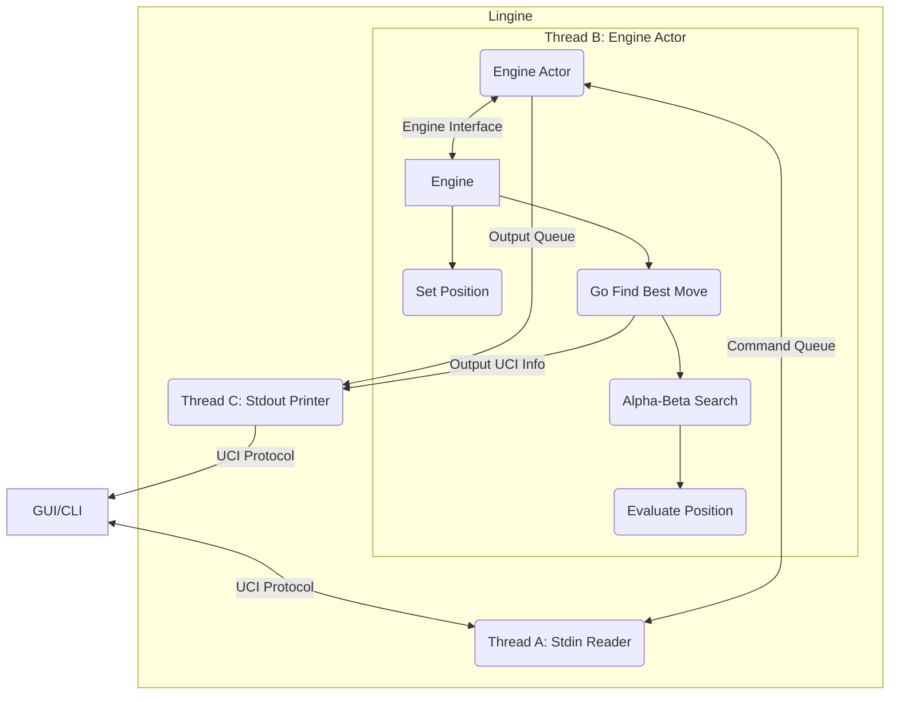
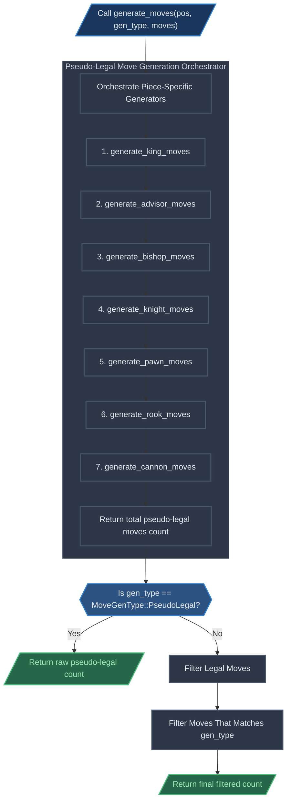
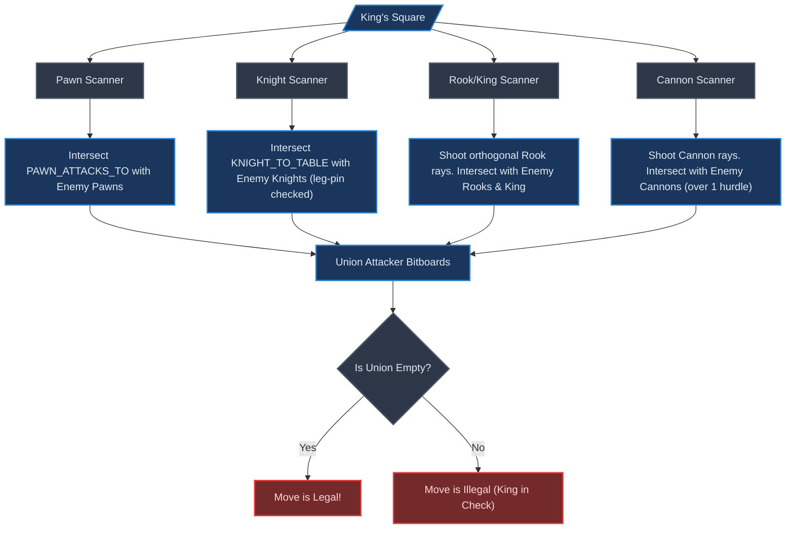
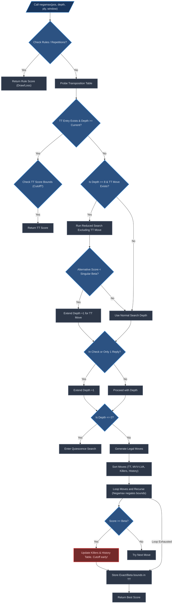
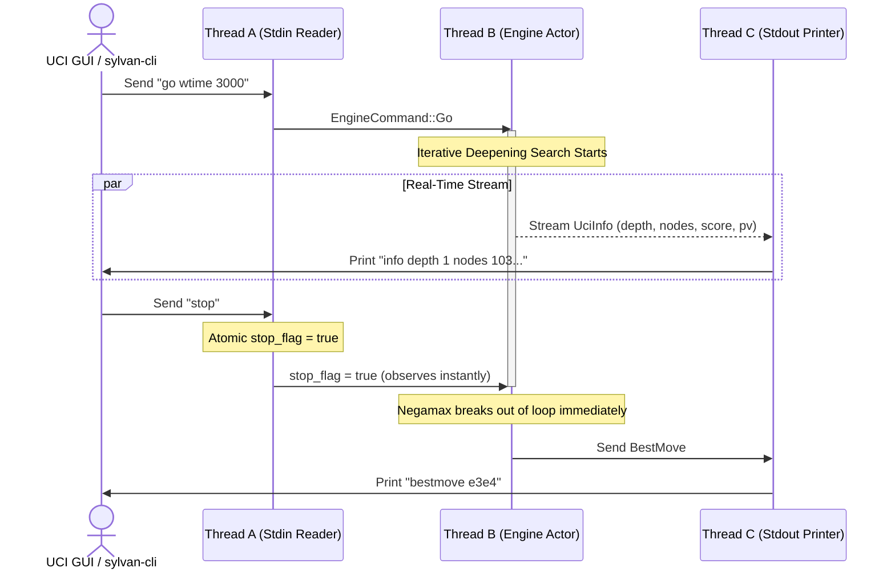

# How Lingine works

This document is to explain how Lingine works under the hood.

## System Architecture Overview

The global architecture is something like the diagram below.



## State representation

### Definition

The state $S$ of a Xiangqi game can be defined as:

$$S = \langle B, p, c_h, h \rangle $$

where,

- $B$ (Board) is a $10 \times 9$ grid of squares, where each square can either
  be empty or house a piece from the 14 available piece types (7 for each side).
- $p$ (Player) is the player who is allowed to move next, can be either Red or
  Black.
- $c_h$ (Count Half-move) is the number of plys (half-move) that tracks the
  60-move rule, it increments on every non-capturing move and resets to 0
  immediately upon any piece capture.
- $h$ (History) is the chronological sequence of all moves performed up until
  the current ply, used to detect illegal repetitions and perpetual checks.

### How Lingine represents it

Inside [position.rs](src/core/position.rs) you can find out how we represent a
position. Specifically,

```rust
#[derive(Clone)]
pub struct Position {
    /// Flat 90-square array mapping square index (0 to 89) to the Piece
    /// occupying it.
    board: [Piece; Square::COUNT],
    /// Precomputed bitboards showing piece placements grouped by `PieceType`.
    bitboard_by_type: [Bitboard; PieceType::COUNT],
    /// Precomputed bitboards showing piece placements grouped by `Color`.
    bitboard_by_color: [Bitboard; Color::COUNT],

    /// Active count of each piece category on the board.
    piece_count: [u8; Piece::COUNT],
    /// Stack tracking previous move parameter histories for undoing moves.
    history: Vec<StateInfo>,
    /// Total moves played in the game so far (White = 0, Black = 1, White's
    /// next = 2, etc.).
    game_ply: u16,
    /// The player active to play next.
    side_to_move: Color,

    /// Current transposition hash of the board position.
    zobrist_hash: u64,
    /// Palace coordinates of both players' Generals (Kings) for faster check
    /// detection.
    king_squares: [Square; Color::COUNT],
}
```

The `StateInfo` struct holds additional information for each move made in the
game. Specifically,

```rust
#[derive(Clone, Copy, Debug)]
pub struct StateInfo {
    /// The exact move executed to reach this state.
    pub last_move: Move,
    /// The piece captured during this move, or `Piece::None` if it was quiet.
    pub captured_piece: Piece,
    /// The prior Zobrist position hash value before the move occurred.
    pub old_zobrist: u64,
    /// Halfmove clock / 60-rule counter (increments on quiet moves, resets to 0
    /// on captures/pawn moves).
    pub rule60: u16,
    /// Whether each color [White, Black] was in check in this position state.
    pub in_check: [bool; Color::COUNT],
    /// Precalculated incremental material score (from White's perspective)
    pub material_score: i32,
    /// Precalculated incremental piece-square table positional score (from
    /// White's perspective)
    pub piece_square_table_score: i32,
}
```

## Move generation

The move generation process can be visualized like this:



### Static lookup tables

Since we represented our boards as bitboards, we can quickly calculate the
squares we might use our piece to attack at compile-time.

```rust
// Precomputed static lookup tables dissolved at compile-time to eliminate
// thread checks, lock contention, and atomic operations during perft search
// loops.
pub static KING_ATTACKS: [Bitboard; 90] = init_king_attacks();
pub static ADVISOR_ATTACKS: [Bitboard; 90] = init_advisor_attacks();
pub static PAWN_ATTACKS: [[Bitboard; 90]; 2] = init_pawn_attacks();
pub static PAWN_ATTACKS_TO: [[Bitboard; 90]; 2] = init_pawn_attacks_to();
pub static BISHOP_TABLE: [BishopEntry; 90] = init_bishop_table();
pub static KNIGHT_TABLE: [KnightEntry; 90] = init_knight_table();
pub static RANK_TABLE: [RankEntry; 9] = init_rank_table();
pub static FILE_TABLE: [FileEntry; 10] = init_file_table();
pub static KNIGHT_TO_TABLE: [KnightToEntry; 90] = init_knight_to_table();
```

Due to this, our move generation usually look something like this:

```rust
let us = if IS_WHITE { Color::White } else { Color::Black };
let us_pieces = pos.bitboard_by_color(us);
let mut advisors = pos.bitboard_by_type(PieceType::Advisor) & us_pieces;
while let Some(from_sq) = advisors.pop_lsb() {
    let mut target_bb = Bitboard(ADVISOR_ATTACKS[from_sq as usize].0 & !us_pieces.0);
    while let Some(to_sq) = target_bb.pop_lsb() {
        moves[*count] = Move::new(from_sq, to_sq);
        *count += 1;
    }
}
```

### Pseudo-Legal Move Generation

Move generation in Lingine is designed to be highly optimized and entirely
heap-allocation free. All moves are accumulated into an `ArrayVec<Move, 128>`
stack-allocated structure (`MoveList`), eliminating memory allocation overhead
in performance-critical search paths. The generation divides pieces into three
distinct categories based on their movement patterns and blockability:
unblockable leaping pieces, blockable leaping pieces, and sliding pieces.

#### 1. Leaping Pieces (King, Advisor, Pawn)

For pieces that do not have their paths obstructed by intermediate pieces, the
valid destination squares are computed by querying static, pre-calculated lookup
tables at compile-time and masking out squares occupied by friendly pieces.

- **King (General)**: confinded to the $3 \times 3$ Palace. It moves exactly 1
  step orthogonally:
  $$\text{King Attacks} = \text{KING\_ATTACKS}[\text{from\_sq}] \cap \neg \text{us\_pieces}$$
- **Advisor**: confined to the diagonal paths within the Palace (yielding
  exactly 5 valid squares on the board). It moves exactly 1 step diagonally:
  $$\text{Advisor Attacks} = \text{ADVISOR\_ATTACKS}[\text{from\_sq}] \cap \neg \text{us\_pieces}$$
- **Pawn (Soldier)**: Its movement rules change dynamically based on whether it
  has crossed the river separating the two territories:
  - **Unpromoted (own side)**: Can only move exactly 1 step straight forward.
  - **Promoted (crossed river)**: Can move 1 step forward OR 1 step horizontally
    (left/right).

  A White Pawn is promoted when its rank index is $\ge 5$, while a Black Pawn is
  promoted when its rank index is $\le 4$. The attack mask is retrieved
  instantly:
  $$\text{Pawn Attacks} = \text{PAWN\_ATTACKS}[\text{color\_idx}][\text{from\_sq}] \cap \neg \text{us\_pieces}$$

```rust
/// Generates diagonal moves for Advisors inside the Palace.
fn generate_advisor_moves<const IS_WHITE: bool>(pos: &Position, moves: &mut MoveList) {
    let us = if IS_WHITE { Color::White } else { Color::Black };
    let us_pieces = pos.bitboard_by_color(us);
    let mut advisors = pos.bitboard_by_type(PieceType::Advisor) & us_pieces;
    while let Some(from_sq) = advisors.pop_lsb() {
        let mut target_bb = ADVISOR_ATTACKS[from_sq as usize] & !us_pieces;
        while let Some(to_sq) = target_bb.pop_lsb() {
            moves.push(Move::new(from_sq, to_sq));
        }
    }
}
```

#### 2. Blockable Leaping Pieces (Bishop, Knight)

For leaping pieces that can be blocked by intermediate pieces, the engine uses a
fast bitwise indexing strategy to query attack tables in $O(1)$ time.

- **Bishop (Elephant)**: Moves exactly 2 steps diagonally and cannot cross the
  river. It is blocked if there is any piece occupying the intermediate diagonal
  square (referred to as the "Bishop's eye").
  - `BISHOP_TABLE[from_sq]` contains up to 4 possible eye squares
    (`eyes: [Option<Square>; 4]`) and a 16-entry array of attack bitboards
    (`attacks: [Bitboard; 16]`).
  - A 4-bit occupancy key `occ_idx` is dynamically constructed by checking if
    the eye squares are occupied. This key is used to look up the precalculated
    attacks mask:
    $$\text{occ\_idx} = \sum_{i=0}^{3} (\text{is\_occupied}(\text{eye}_i) \ll i)$$
    $$\text{Bishop Attacks} = \text{BISHOP\_TABLE}[\text{from\_sq}].\text{attacks}[\text{occ\_idx}] \cap \neg \text{us\_pieces}$$

```rust
/// Generates diagonal moves for Elephants (Bishops), checking diagonal blocker intermediate eyes.
fn generate_bishop_moves<const IS_WHITE: bool>(pos: &Position, moves: &mut MoveList) {
    let us = if IS_WHITE { Color::White } else { Color::Black };
    let us_pieces = pos.bitboard_by_color(us);
    let occupied = pos.bitboard_by_color(Color::White) | pos.bitboard_by_color(Color::Black);
    let mut bishops = pos.bitboard_by_type(PieceType::Bishop) & us_pieces;

    while let Some(from_sq) = bishops.pop_lsb() {
        let entry = &BISHOP_TABLE[from_sq as usize];
        let mut occ_idx = 0;
        let mut i = 0;
        while i < 4 {
            if let Some(eye_sq) = entry.eyes[i] && occupied.is_occupied(eye_sq) {
                occ_idx |= 1 << i;
            }
            i += 1;
        }
        let mut target_bb = entry.attacks[occ_idx] & !us_pieces;
        while let Some(to_sq) = target_bb.pop_lsb() {
            moves.push(Move::new(from_sq, to_sq));
        }
    }
}
```

- **Knight (Horse)**: Moves in an L-shape (1 step orthogonally followed by 1
  step diagonally outward). It is blocked if there is any piece occupying the
  adjacent orthogonal square (the "Horse leg").
  - `KNIGHT_TABLE[from_sq]` contains up to 4 possible leg squares
    (`eyes: [Option<Square>; 4]`) and a 16-entry array of attack bitboards
    (`attacks: [Bitboard; 16]`).
  - Just like the Bishop, a 4-bit leg-occupancy index is constructed in $O(1)$
    and used to retrieve the active attack bitboard:
    $$\text{Knight Attacks} = \text{KNIGHT\_TABLE}[\text{from\_sq}].\text{attacks}[\text{occ\_idx}] \cap \neg \text{us\_pieces}$$

#### 3. Sliding Pieces (Rook, Cannon)

Sliding pieces (Chariot and Cannon) present a unique challenge due to their
long-range movement. Lingine optimizes this by handling rank-based (horizontal)
and file-based (vertical) sliding attacks separately:

##### Horizontal Rank Extraction

Since a rank consists of 9 contiguous squares in a rank-major $10 \times 9$
layout, we can extract the 9-bit occupancy state of rank $r$ instantly by
shifting the raw 128-bit board value and masking the lowest 9 bits:
$$\text{rank\_occ} = (\text{occupied.raw()} \gg (r \times 9)) \ \& \ 0x1\text{FF}$$
The horizontal attacks are queried directly in $O(1)$ via the precomputed
`RANK_TABLE[file].rook[rank_occ]`.

##### Vertical File Extraction via Magic Multiplication

Because file squares are spaced exactly 9 bits apart, gathering them into a
contiguous index is highly expensive in a standard loop. Lingine resolves this
by performing **Magic Multiplication** inside `gather_file_bits`:

1. Shift the raw bitboard value right by the file index $f$.
2. Split the resulting bits into two 64-bit halves: `low` (bottom 5 ranks) and
   `high` (top 5 ranks).
3. Mask each half using `0x10_0804_0201` to isolate the 5 bits spaced at 9-bit
   intervals.
4. Multiply each masked value by the magic constant `0x1010101010` which
   mathematically shifts and sums the spaced bits, aligning them into a
   contiguous 5-bit block starting at bit 36.
5. Shift down by 36 and mask the lowest 5 bits (`& 0x1F`) to obtain clean
   indices `key_low` and `key_high`.
6. Combine both keys to form a 10-bit vertical occupancy index:
   $$\text{file\_occ} = \text{key\_low} \ | \ (\text{key\_high} \ll 5)$$

Using this 10-bit vertical index, the file attack mask is retrieved in $O(1)$
from `FILE_TABLE[rank].rook[file_occ]`. This mask is mapped back to a full
vertical `Bitboard` using the precalculated static matrix
`FILE_ATTACKS_BY_MASK[file][file_attack_mask]`.

```rust
/// Collects (gathers) the vertical file occupancy states into a 10-bit integer.
/// Shifts, masks, and packs spaced bits dynamically in O(1) time.
#[inline(always)]
pub fn gather_file_bits(bits: u128, f: usize) -> usize {
    let occ = bits >> f;
    let low = occ as u64;
    let high = (occ >> 45) as u64;

    let val_low = low & 0x10_0804_0201;
    let val_high = high & 0x10_0804_0201;

    let key_low = (val_low.wrapping_mul(0x1010101010) >> 36) & 0x1F;
    let key_high = (val_high.wrapping_mul(0x1010101010) >> 36) & 0x1F;

    (key_low | (key_high << 5)) as usize
}
```

##### Cannon Attack Mechanics

Cannons move quiet like Rooks but capture by leaping over exactly one piece (the
"hurdle" or "platform"). We leverage the same horizontal and vertical occupancy
indices, but split their moves into quiet slides and leap captures:

- **Quiet Moves**: The same table lookups are used, but we filter out occupied
  squares using a bitwise AND:
  $$\text{quiet\_moves} = \text{attacks\_rook} \cap \neg \text{occupied}$$
- **Leap Captures**: Probes the precalculated Cannon table and intersects the
  results with the opponent's pieces:
  $$\text{captures} = \text{attacks\_cannon} \cap \text{them\_pieces}$$
- The final attack set is the union of quiet moves and leap captures:
  $$\text{Cannon Attacks} = \text{quiet\_moves} \cup \text{captures}$$

---

### The Backward Attack Scanner ($O(1)$ Checker Detection)

To verify if a move is legal, we must ensure that it does not leave our King in
check. Generating the entire list of opponent moves to check for attacks is
computationally expensive. Lingine avoids this entirely by implementing a
loopless, high-performance **Backward Attack Scanner** in `checkers_to` and
`checkers_to_after_move`.

Instead of checking which opponent pieces can attack the King, the scanner
shoots virtual "rays" and "leaps" outward from the King's square to detect any
enemy pieces that could strike the King. This reverses the attack logic in
$O(1)$ time:



1. **Pawn Scanner**: Probes the reverse pawn attack table
   `PAWN_ATTACKS_TO[them_color_idx][king_sq]` and intersects it with enemy Pawn
   locations.
2. **Knight Scanner**: Probes `KNIGHT_TO_TABLE[king_sq]`. Each entry contains up
   to 6 potential Horse leg squares. The scanner checks their occupancy to build
   a 6-bit occupancy mask, queries `entry.attacks[occ_idx]` to get active Knight
   attacks, and intersects it with enemy Knights.
3. **Rook & King Scanner**: Traces orthogonal sliding rays from the King's
   square using Rook sliding logic. Intersects with enemy Rooks and the enemy
   King. This naturally implements the **Flying General** rule where two Kings
   facing each other on an open file counts as an illegal check (treated as a
   virtual Rook attack).
4. **Cannon Scanner**: Traces Cannon rays outward from the King's square using
   Cannon sliding logic, finding all squares that have exactly one piece between
   them and the King, and intersects them with enemy Cannons.

```rust
/// Traces split rank/file leap capture paths to find all pieces attacking a square in O(1).
#[inline(always)]
fn checkers_to(&self, square: Square, occupied: Bitboard, attacker: Color) -> Bitboard {
    let opponent_pawns = self.bitboard_by_type[PieceType::Pawn as usize] & self.bitboard_by_color[attacker as usize];
    let opponent_knights = self.bitboard_by_type[PieceType::Knight as usize] & self.bitboard_by_color[attacker as usize];
    let opponent_rooks = self.bitboard_by_type[PieceType::Rook as usize] & self.bitboard_by_color[attacker as usize];
    let opponent_cannons = self.bitboard_by_type[PieceType::Cannon as usize] & self.bitboard_by_color[attacker as usize];
    let opponent_king = self.bitboard_by_type[PieceType::King as usize] & self.bitboard_by_color[attacker as usize];

    // 1. Pawn scanner
    let them_color_idx = if attacker == Color::White { 0 } else { 1 };
    let pawn_attackers = PAWN_ATTACKS_TO[them_color_idx][square as usize] & opponent_pawns;

    // 2. Knight scanner (Horse-Leg / blocking-pin aware)
    let entry = &KNIGHT_TO_TABLE[square as usize];
    let mut occ_idx = 0;
    let mut i = 0;
    while i < 6 {
        if let Some(eye_sq) = entry.eyes[i] && occupied.is_occupied(eye_sq) {
            occ_idx |= 1 << i;
        }
        i += 1;
    }
    let knight_attackers = entry.attacks[occ_idx] & opponent_knights;

    // 3. Rook & King scanner (orthogonal sliding rays + Flying General rule)
    let rook_atk = rook_attacks(square, occupied);
    let rook_attackers = rook_atk & (opponent_rooks | opponent_king);

    // 4. Cannon scanner (platform-leap captures)
    let cannon_atk = cannon_attacks(square, occupied);
    let cannon_attackers = cannon_atk & opponent_cannons;

    Bitboard::from_raw(pawn_attackers.raw() | knight_attackers.raw() | rook_attackers.raw() | cannon_attackers.raw())
}
```

---

### Move Legality Verification

The primary entry point `generate_moves` orchestrates move generation and
filters out illegal moves using the following flow:

1. **Generate Pseudo-Legal Moves**: King, Advisor, Bishop, Knight, Pawn, Rook,
   and Cannon move generators are executed in sequence, pushing their moves to
   the stack-allocated `MoveList`.
2. **Filter by MoveGenType**: If the caller requested
   `MoveGenType::PseudoLegal`, the raw count is returned immediately with zero
   overhead. Otherwise, the engine iterates over the moves and validates their
   legality:

   ```rust
   #[inline(always)]
   pub fn legal(&self, m: Move) -> bool {
       let us = self.side_to_move;
       let from = m.square_from();
       let to = m.square_to();
       let moved_piece = self.board[from as usize];

       let king_sq = if moved_piece.piece_type() == PieceType::King { to } else { self.king_square(us) };

       // Simulate the move by updating the occupancy mask
       let mut occupied = self.bitboard_by_color[Color::White as usize] | self.bitboard_by_color[Color::Black as usize];
       occupied.clear_bit(from);
       occupied.set_bit(to);

       // Verify if the King is attacked after the simulated move
       self.checkers_to_after_move(king_sq, occupied, us.opposite(), from, to, moved_piece).is_empty()
   }
   ```

3. **Refine List**: Moves that leave the King in check are pruned. Quiet moves,
   captures, or evasions are selectively preserved based on the requested
   `MoveGenType` (e.g. `Captures`, `Quiets`, `Evasions`, or `Legal`).

---

## Search Subsystem

Lingine's search engine is built around a highly optimized, recursive
**Fail-Soft Alpha-Beta Negamax Search**. The search incorporates modern pruning
algorithms, transposition tables, search extensions, and game-specific
evaluation rule judges:



### 1. Fail-Soft Negamax Formulation

The negamax formulation simplifies alpha-beta search by exploiting the zero-sum
nature of chess:
$$\text{negamax}(S, d) = \max_{m \in M} (-\text{negamax}(S \times m, d-1))$$
Using the **Fail-Soft** variant, the engine returns the exact value of the best
evaluated move even if it falls outside the active $[\alpha, \beta]$ search
window. This provides highly accurate bounds for pruning decisions in parent
nodes.

### 2. Transposition Table (TT)

Probes a persistent, cache-aligned transposition table using the Zobrist hash of
the current board state. It stores:

- **Best Move**: The move that returned the highest score at this node.
- **Depth**: The depth to which this sub-tree was searched.
- **Flag**: Represents the score bound (Exact, Alpha, Beta).
- **Score**: Centipawn evaluation. Mate scores are dynamically converted to/from
  transposition representation to reflect the mate-distance relative to the
  current search ply:
  $$
  \text{score\_to\_transposition}(v, \text{ply}) = \begin{cases}
    v + \text{ply} & \text{if } v > \text{MATE\_VALUE} - 1000 \\
    v - \text{ply} & \text{if } v < -\text{MATE\_VALUE} + 1000 \\
    v & \text{otherwise}
  \end{cases}
  $$

If the probed depth is greater than or equal to the current target depth, and
the stored score satisfies the alpha-beta bounds (e.g. Beta score $\ge \beta$),
the sub-tree is pruned instantly.

### 3. Singular Extensions

Singular Extensions are triggered when a transposition table probe yields a
highly dominant best move (`tt_move`) that is significantly stronger than any
alternative.

- **Conditions**: Activated when depth $d \ge 8$, a valid `tt_move` exists, the
  node is not already under exclusion, and the TT depth is within $d-3$ of the
  search target.
- **Execution**: We execute a reduced-depth search ($d' = d - 3$) with a highly
  restricted beta bound (singular beta):

  $$\beta_{\text{singular}} = \text{tt\_score} - 2d$$ during which the `tt_move`
  is completely excluded from search.

- **Extension**: If the best alternative score falls below
  $\beta_{\text{singular}}$, it confirms the `tt_move` is singularly superior.
  The search depth for the `tt_move` is then extended by $+1$ to explore this
  critical line deeper.

### 4. Check & One-Reply Extensions

- **Check Extensions**: If the active side is in check, depth is extended by
  $+1$ to ensure tactical threats are not missed due to the horizon effect.
- **One-Reply Extensions**: If the position has exactly one legal reply, depth
  is extended by $+1$. This prevents the engine from stopping search early in
  forced tactical lines.
- _Safety Cap_: The cumulative extensions are strictly capped at a maximum of
  $+6$ per branch to prevent runaway depth expansion and stack overflows.

### 5. Quiescence Search

Once depth reaches $d \le 0$, the search transitions to a specialized
**Quiescence Search** to avoid the horizon effect.

- **Standing Pat**: The engine takes the static evaluation score as the lower
  bound. If the static evaluation exceeds $\beta$, it cutsoff early without
  searching moves:
  $$\text{stand\_pat} \ge \beta \implies \text{return } \text{stand\_pat}$$
- **Selective Move Generation**: If the King is in check, it generates all legal
  evasions to protect the King. Otherwise, it only generates capture moves.
- **Hard Termination**: To guarantee search terminates and prevent stack
  overflows from infinite check/capture loops, a hard depth cap of
  `qdepth >= 12` is enforced.

### 6. Move Ordering

Highly optimized move ordering is the key to deep alpha-beta pruning. Moves are
sorted dynamically on the stack using the following priority scores:

1. **Transposition Table Best Move**: Ranked first with a score of `20000`.
2. **Captures via MVV-LVA**: Sorted based on the value of the victim piece and
   the attacker:
   $$\text{Score}_{\text{MVV-LVA}} = 10000 + (100 \times \text{VictimRank}) - \text{AttackerRank}$$
   This ensures that highly valuable pieces (like Rooks) captured by cheap
   pieces (like Pawns) are searched first.
3. **Killer Moves**: Up to 2 quiet moves that caused beta cutoffs in sister
   nodes at the same ply are scored at `9000` and `8000`.
4. **History Heuristic**: Quiet moves are sorted based on their historically
   recorded success rates `history_table[color][from][to]` (capped at `7000`).
   If a quiet move causes a beta cutoff, its history score is incremented:
   $$\text{History} \leftarrow \min(\text{History} + d^2, 7000)$$

---

### Repetition & Perpetual Rules (Xiangqi Cycle Rules)

The Chinese Chess Association repetition rules are incredibly complex,
distinguishing between harmless repetitions and prohibited perpetual checks or
chases. Lingine implements these rules robustly via `pos.rule_judge(ply)`:

1. **Zobrist History Scanning**: Checks the game history stack for identical
   Zobrist hashes. If the current position occurred previously:
2. **Check and Chase Assessment**:
   - **Perpetual Check**: If a player repeatedly checks the opponent King in a
     repeating cycle, they are penalized with an immediate loss:
     $$\text{Score} = -\text{MATE\_VALUE} + \text{ply}$$
   - **Perpetual Chase**: If a player repeatedly attacks an opponent piece in a
     repeating cycle using one or more pieces, they are also penalized with an
     immediate loss.
   - **Harmless Repetition (Draw)**: If both players are repeating harmless
     moves (e.g. moving a King back and forth without giving check or chase),
     the position is judged as a draw (returning a score of `0`).
3. **60-Move Rule**: Tracks the half-move counter (`rule60` inside `StateInfo`).
   If 120 half-moves (60 full moves) pass without any captures, the game is
   declared a draw (`0`).

---

## Static Evaluation Subsystem

Lingine's static evaluation combines base material weights with dynamic
Piece-Square Tables (PST) to assess the strength of a position:

### 1. Centipawn Material Values

The base weights for the pieces are defined as:

- **Chariot (Rook)**: $600$ centipawns.
- **Cannon**: $285$ centipawns.
- **Horse (Knight)**: $270$ centipawns.
- **Elephant (Bishop)**: $120$ centipawns.
- **Advisor**: $110$ centipawns.
- **King (General)**: $0$ centipawns (treated as $0$ since Kings can never be
  captured; checkmate is handled by the search bounds).
- **Soldier (Pawn)**:
  - _Unpromoted (own side)_: $30$ centipawns.
  - _Promoted (crossed river)_: $70$ centipawns. Pawns gain $+40$ centipawns
    upon crossing the river, representing their ability to move and attack
    horizontally.

### 2. Piece-Square Tables (PST) & Mirrored Symmetries

To evaluate positional play (e.g., active lanes, safe palace positions, and
advanced pawns), each piece type has a $10 \times 9$ positional table mapping
squares to centipawn bonuses or penalties.

- **Symmetry & Mirroring**: To save memory and guarantee symmetric play, we
  store PSTs solely from White's (Red's) perspective. When evaluating a Black
  piece on a square, the square's coordinates are mirrored vertically and
  horizontally before querying the table:
  $$\text{mirrored\_rank} = 9 - \text{rank}$$
  $$\text{mirrored\_file} = 8 - \text{file}$$
  $$\text{index}_{\text{PST}} = \text{mirrored\_rank} \times 9 + \text{mirrored\_file}$$
  This mirroring mirrors the strategic layout perfectly, ensuring both sides
  strive for identical positional goals.

### 3. Incremental Evaluation

Performing a full board scan of all 90 squares at every single search node would
be prohibitively slow. Lingine avoids this by maintaining `material_score` and
`piece_square_table_score` **incrementally**:

- The `StateInfo` struct stores the pre-calculated scores for the current state.
- When `do_move` executes:
  - Subtract the material and PST scores of the moving piece from its origin
    square.
  - Add the material and PST scores of the moving piece at its destination
    square.
  - If a capture occurred, subtract the material and PST scores of the captured
    piece.
  - If a Pawn crossed the river during the move, apply the $+40$ centipawn
    promotion bonus.
- When `undo_move` executes, the scores are rolled back instantly by popping the
  previous `StateInfo` from the history stack.
- This incremental strategy reduces static evaluation to an $O(1)$ operation,
  boosting search speeds.

---

## Threading Architecture and the UCI Handler

To handle concurrent GUI inputs (such as stopping search mid-calculation)
without losing thread safety or suffering from print races, Lingine implements
an actor-based **3-Threaded Architecture** to orchestrate the UCI loop:



### Thread A — Stdin Reader

- **Role**: Runs on the main calling thread. It reads incoming text commands
  from `stdin` in a blocking loop.
- **Command Parsing**: Parses strings into typed `EngineCommand` tokens.
- **Instant Interruption**: When it encounters a `Stop` or `Quit` command, it
  immediately stores `true` in a shared atomic `stop_flag` (`Arc<AtomicBool>`)
  _before_ pushing the command onto the channel. This allows the recursive
  Negamax search running in Thread B to observe the stop signal instantly and
  exit, without waiting for the command queue to drain.

### Thread B — Engine Actor

- **Role**: Spawned at startup, this thread exclusively owns the `Position`
  state and the search execution structures.
- **Command Dispatching**: Pulls `EngineCommand` objects from its incoming
  channel and dispatches them to the Engine.
- **Non-Blocking Streams**: When executing `Go`, Thread B blocks to run
  iterative deepening. To stream search updates
  (`info depth ... nodes ... nps ... pv`) without blocking the search, it spawns
  a short-lived **Forwarder Thread**. This forwarder thread drains search
  statistics from a local channel and bridges them to Thread C in real-time. It
  exits automatically when the search finishes and the channel is dropped.

### Thread C — Output Printer

- **Role**: Spawned at startup, this thread is the **sole owner of stdout**
  (`println!`).
- **Mutex-Free Serialization**: It pulls print tasks from an output channel and
  prints them sequentially. Having a single thread write to stdout prevents
  interleaved text, race conditions, and corrupted outputs when search streams
  updates concurrently with UCI state prints.

---
