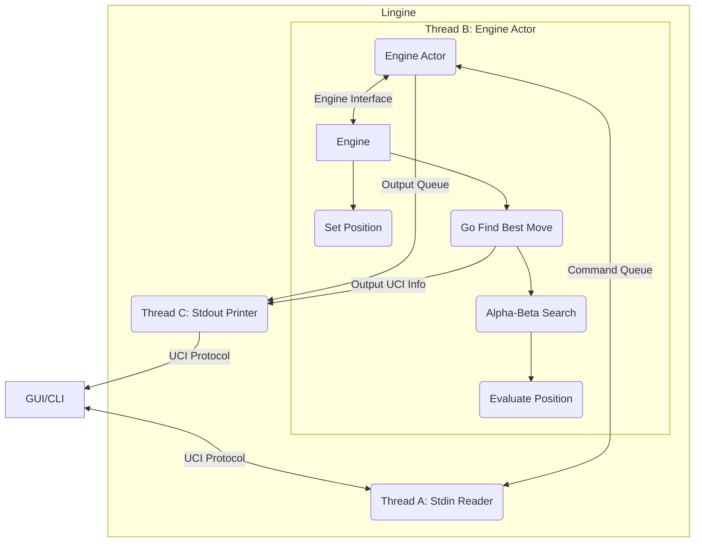
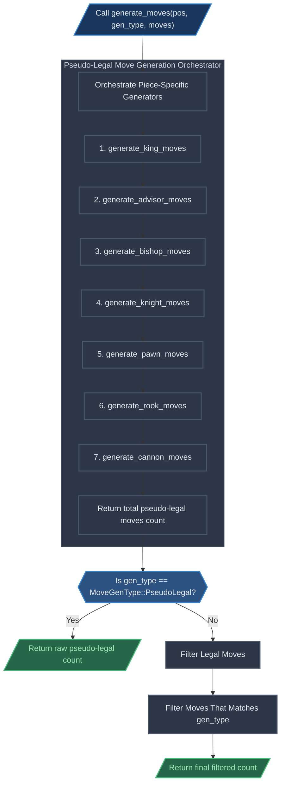
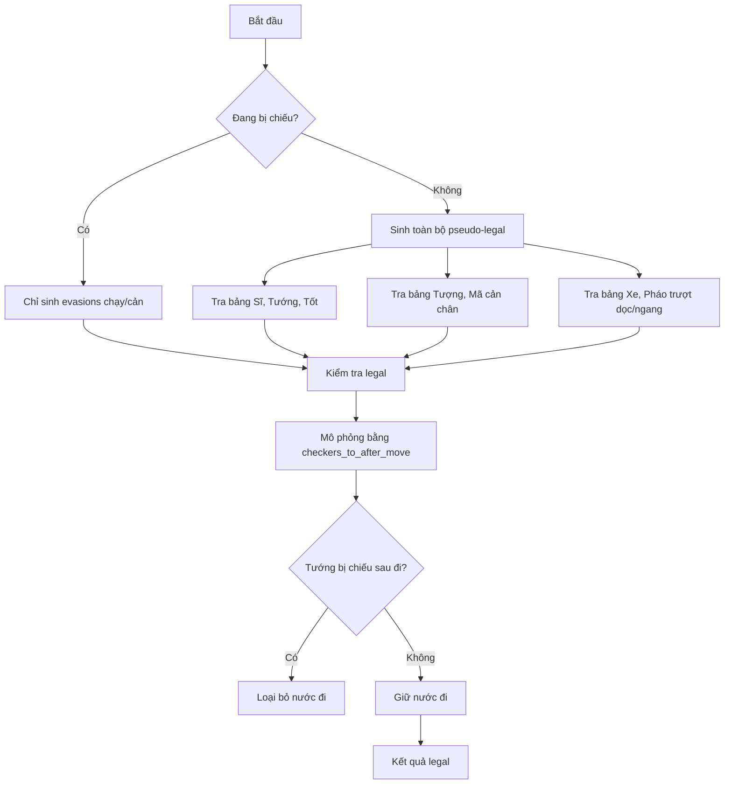
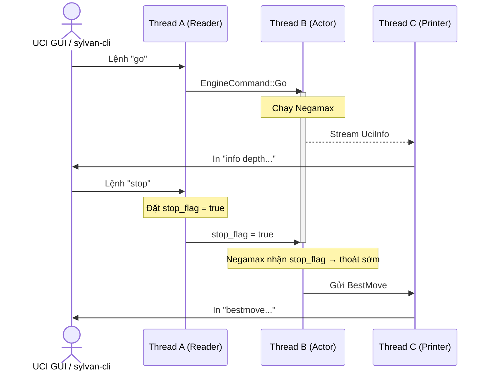

# How Lingine works

This document is to explain how Lingine works under the hood.

## System Architecture Overview

The global architecture is something like the diagram below.



## State representation

### Definition

The state $S$ of a Xiangqi game can be defined as:

$$S = \langle B, p, c_h, h \rangle $$

where,

- $B$ (Board) is a $10 \times 9$ grid of squares, where each square can either
  be empty or house a piece from the 14 available piece types (7 for each side).
- $p$ (Player) is the player who is allowed to move next, can be either Red or Black.
- $c_h$ (Count Half-move) is the number of plys (half-move) that tracks the
  60-move rule, it increments on every non-capturing move and resets to 0
  immediately upon any piece capture.
- $h$ (History) is the chronological sequence of all moves performed up until
  the current ply, used to detect illegal repetitions and perpetual checks.

### How Lingine represents it

Inside [position.rs](src/core/position.rs) you can find out how we represent a
position. Specifically,

```rust
#[derive(Clone)]
pub struct Position {
    /// Flat 90-square array mapping square index (0 to 89) to the Piece
    /// occupying it.
    board: [Piece; Square::COUNT],
    /// Precomputed bitboards showing piece placements grouped by `PieceType`.
    bitboard_by_type: [Bitboard; PieceType::COUNT],
    /// Precomputed bitboards showing piece placements grouped by `Color`.
    bitboard_by_color: [Bitboard; Color::COUNT],

    /// Active count of each piece category on the board.
    piece_count: [u8; Piece::COUNT],
    /// Stack tracking previous move parameter histories for undoing moves.
    history: Vec<StateInfo>,
    /// Total moves played in the game so far (White = 0, Black = 1, White's
    /// next = 2, etc.).
    game_ply: u16,
    /// The player active to play next.
    side_to_move: Color,

    /// Current transposition hash of the board position.
    zobrist_hash: u64,
    /// Palace coordinates of both players' Generals (Kings) for faster check
    /// detection.
    king_squares: [Square; Color::COUNT],
}
```

The `StateInfo` struct holds additional information for each move made in the
game. Specifically,

```rust
#[derive(Clone, Copy, Debug)]
pub struct StateInfo {
    /// The exact move executed to reach this state.
    pub last_move: Move,
    /// The piece captured during this move, or `Piece::None` if it was quiet.
    pub captured_piece: Piece,
    /// The prior Zobrist position hash value before the move occurred.
    pub old_zobrist: u64,
    /// Halfmove clock / 60-rule counter (increments on quiet moves, resets to 0
    /// on captures/pawn moves).
    pub rule60: u16,
    /// Whether each color [White, Black] was in check in this position state.
    pub in_check: [bool; Color::COUNT],
    /// Precalculated incremental material score (from White's perspective)
    pub material_score: i32,
    /// Precalculated incremental piece-square table positional score (from
    /// White's perspective)
    pub piece_square_table_score: i32,
}
```

## Move generation

The move generation process can be visualized like this:



### Static lookup tables

Since we represented our boards as bitboards, we can quickly calculate the squares we might use our piece to attack at compile-time.

```rust
// Precomputed static lookup tables dissolved at compile-time to eliminate
// thread checks, lock contention, and atomic operations during perft search
// loops.
pub static KING_ATTACKS: [Bitboard; 90] = init_king_attacks();
pub static ADVISOR_ATTACKS: [Bitboard; 90] = init_advisor_attacks();
pub static PAWN_ATTACKS: [[Bitboard; 90]; 2] = init_pawn_attacks();
pub static PAWN_ATTACKS_TO: [[Bitboard; 90]; 2] = init_pawn_attacks_to();
pub static BISHOP_TABLE: [BishopEntry; 90] = init_bishop_table();
pub static KNIGHT_TABLE: [KnightEntry; 90] = init_knight_table();
pub static RANK_TABLE: [RankEntry; 9] = init_rank_table();
pub static FILE_TABLE: [FileEntry; 10] = init_file_table();
pub static KNIGHT_TO_TABLE: [KnightToEntry; 90] = init_knight_to_table();
```

Due to this, our move generation usually look something like this:

```rust
let us = if IS_WHITE { Color::White } else { Color::Black };
let us_pieces = pos.bitboard_by_color(us);
let mut advisors = pos.bitboard_by_type(PieceType::Advisor) & us_pieces;
while let Some(from_sq) = advisors.pop_lsb() {
    let mut target_bb = Bitboard(ADVISOR_ATTACKS[from_sq as usize].0 & !us_pieces.0);
    while let Some(to_sq) = target_bb.pop_lsb() {
        moves[*count] = Move::new(from_sq, to_sq);
        *count += 1;
    }
}
```

### King moves

- **Quân nhảy**:
  - **Sĩ & Tướng**: Tra bảng tĩnh (`ADVISOR_ATTACKS`, `KING_ATTACKS`). Giới hạn
    trong Palace.
  - **Tốt**: Tra bảng tĩnh `PAWN_ATTACKS` theo màu và trạng thái qua sông.
  - **Tượng & Mã**: Kiểm tra cản (mắt Tượng, chân Mã) bằng chỉ số nhị phân tra
    bảng `BISHOP_TABLE` / `KNIGHT_TABLE`.
- **Quân trượt (Xe & Pháo)**:
  - **Dòng**: Dịch bit lấy 9 bit dòng:
    `((occupied.0 >> (r * 9)) & 0x1FF) as usize`.
  - **Cột (Magic Multiplication)**: Hàm `gather_file_bits` nhân ma thuật
    `0x1010101010` để dồn 10 bit dọc thành chỉ số liền kề. Tra bảng trong O(1).
  - Tra `RANK_TABLE`/`FILE_TABLE` lấy nước đi thường (Xe) hoặc nhảy ngòi (Pháo).

#### C. Bộ quét ngược không vòng lặp (Backward Attack Scanner)

- Hàm `checkers_to` và `checkers_to_after_move` xác định chiếu/ghim quân.
- Bắn tia quét ngược từ ô Tướng để tìm quân tấn công.
  1. Tia Xe dọc/ngang → tìm Xe/Tướng đối diện.
  2. Tia Pháo → kiểm tra 1 ngòi cản.
  3. Tra bảng chân Mã ngược → tìm Mã chiếu không bị cản.
  4. Tra vị trí Tốt xung quanh → tìm Tốt áp sát.
- Độ phức tạp **$O(1)$**. Loại bỏ hoàn toàn việc sinh nước đi đối phương.



### 2. Bộ tìm kiếm (Search Subsystem)

```mermaid
gantt
    title Iterative Deepening & Quiescence
    dateFormat  X
    axisFormat %s
    section Duyệt sâu
    Duyệt Depth 1      :active, 0, 2
    Duyệt Depth 2      :active, 2, 5
    Duyệt Depth N...   :active, 5, 10
    section Tĩnh chấn
    Quiescence Search (Ăn quân / Cản chiếu) :crit, 10, 14
```



- **Fail-Soft Alpha-Beta Negamax**: Negamax cắt tỉa Alpha-Beta phiên bản
  Fail-Soft.
- **Iterative Deepening**: Tăng độ sâu từ 1 đến `max_depth` (lên đến 100). Trả
  về best move lập tức khi cạn thời gian.
- **Quiescence Search**: Chỉ tìm nước ăn quân (captures). Bị chiếu → sinh thêm
  evasions. Độ sâu tối đa `qdepth >= 12` để chặn tràn bộ nhớ do chiếu lặp.
- **Sắp xếp nước đi (MVV-LVA)**: Ưu tiên ăn quân để tối đa cắt tỉa:
  $$\text{Score} = 10000 + (\text{Victim} \times 100) - \text{Attacker}$$
- **Lặp lại & Chiếu dai dẳng (Perpetual Check/Chase)**:
  - Quét lịch sử trùng hash Zobrist.
  - Chiếu dai dẳng → phạt thua bên chiếu (`MATE_VALUE - ply`). Lặp cờ thường →
    hòa (`0`).
- **Quản lý thời gian**: Phân bổ theo `wtime`/`btime`, `winc`/`binc` và
  `movestogo`. Giữ dự phòng 50ms hoặc 10% tránh rụng kim do độ trễ GUI.

### 3. Bộ đánh giá tĩnh (Static Evaluation Subsystem)

- **Vật chất cơ bản (centipawns)**:
  - Xe: `600`
  - Pháo: `285`
  - Mã: `270`
  - Tượng: `120`
  - Sĩ: `110`
  - Tướng: Vô hạn (`100,000` điểm)
- **Tốt qua sông**:
  - Chưa qua sông: `30`. Chỉ đi thẳng.
  - Đã qua sông (White rank >= 5, Black rank <= 4): `70`. Thưởng +40 điểm cấu
    trúc. Kích hoạt đi ngang trong sinh nước đi.

### 4. Kiến trúc 3 luồng (3-Threaded Actor Model)

- **Thread A — Stdin Reader**:
  - Đọc `stdin`, phân tích `EngineCommand`.
  - Gặp `stop`/`quit` → đặt `stop_flag = true` (Atomic) lập tức. Ngắt đệ quy
    Thread B tức thì.
- **Thread B — Engine Actor**:
  - Sở hữu độc quyền trạng thái `Position` và Engine.
  - Nhận lệnh `Go` → chạy Negamax. Spawn forwarder truyền real-time `UciInfo`
    sang Thread C.
- **Thread C — Output Printer**:
  - Sở hữu độc quyền `stdout`. Ngăn chặn tranh chấp ghi đè dữ liệu.



---
