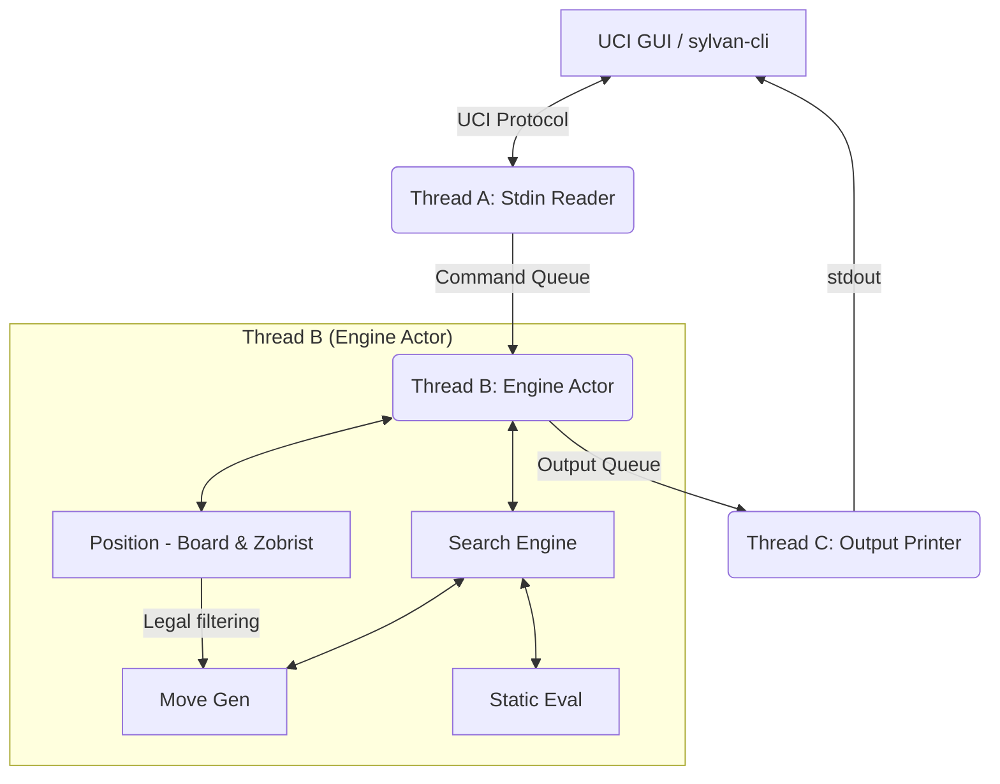
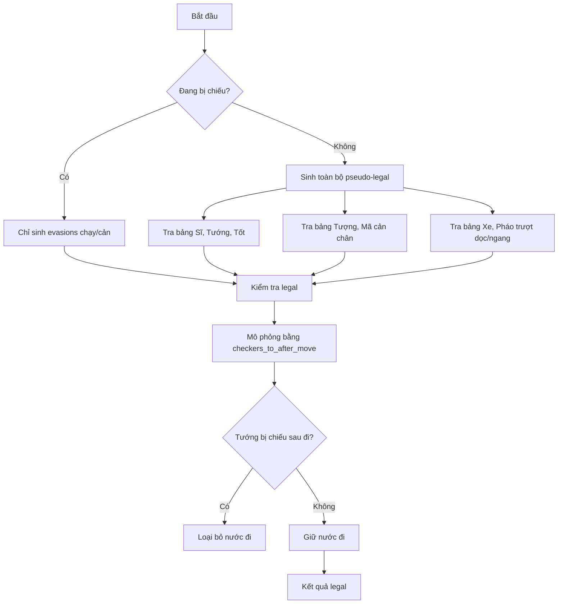
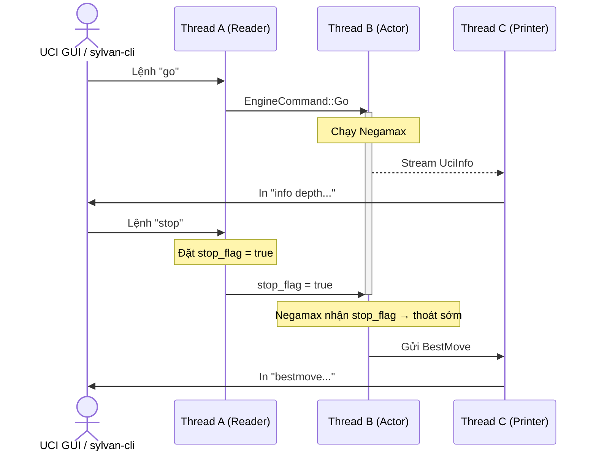

# Lingine — Xiangqi Chess Engine

Engine Cờ Tướng hiệu năng cao bằng Rust. Giao tiếp chuẩn UCI.

---

## Nhóm phát triển

1. **Trần Tuấn Anh** - MSSV: `202416124`
2. **Lê Thành Trung** - MSSV: `202400076`
3. **Bùi Tiến Dũng** - MSSV: `202416167`

## Kiến trúc hệ thống



### 1. Sinh nước đi (Move Generation Subsystem)

#### A. Biểu diễn bàn cờ (Board Representation)

- **Flat Array**: Mảng `[Piece; 90]`. Thứ tự dòng từ `A0` (0) đến `I9` (89).
- **Bitboards**: Cấu trúc `u128` (chỉ dùng bit 0-89).
  - `bitboard_by_type`: Mặt nạ bit từng loại quân (`Rook`, `Knight`, `Bishop`, `Advisor`, `Pawn`, `King`, `Cannon`).
  - `bitboard_by_color`: Mặt nạ bit hai phe (`White`, `Black`).
- **Zobrist Hash**: Cập nhật gia tăng bằng XOR trong `do_move`/`undo_move`. Tránh tính lại từ đầu.

#### B. Sinh nước đi O(1)

- **Quân nhảy**:
  - **Sĩ & Tướng**: Tra bảng tĩnh (`ADVISOR_ATTACKS`, `KING_ATTACKS`). Giới hạn trong Palace.
  - **Tốt**: Tra bảng tĩnh `PAWN_ATTACKS` theo màu và trạng thái qua sông.
  - **Tượng & Mã**: Kiểm tra cản (mắt Tượng, chân Mã) bằng chỉ số nhị phân tra bảng `BISHOP_TABLE` / `KNIGHT_TABLE`.
- **Quân trượt (Xe & Pháo)**:
  - **Dòng**: Dịch bit lấy 9 bit dòng: `((occupied.0 >> (r * 9)) & 0x1FF) as usize`.
  - **Cột (Magic Multiplication)**: Hàm `gather_file_bits` nhân ma thuật `0x1010101010` để dồn 10 bit dọc thành chỉ số liền kề. Tra bảng trong O(1).
  - Tra `RANK_TABLE`/`FILE_TABLE` lấy nước đi thường (Xe) hoặc nhảy ngòi (Pháo).

#### C. Bộ quét ngược không vòng lặp (Backward Attack Scanner)

- Hàm `checkers_to` và `checkers_to_after_move` xác định chiếu/ghim quân.
- Bắn tia quét ngược từ ô Tướng để tìm quân tấn công.
  1. Tia Xe dọc/ngang → tìm Xe/Tướng đối diện.
  2. Tia Pháo → kiểm tra 1 ngòi cản.
  3. Tra bảng chân Mã ngược → tìm Mã chiếu không bị cản.
  4. Tra vị trí Tốt xung quanh → tìm Tốt áp sát.
- Độ phức tạp **$O(1)$**. Loại bỏ hoàn toàn việc sinh nước đi đối phương.



### 2. Bộ tìm kiếm (Search Subsystem)

```mermaid
gantt
    title Iterative Deepening & Quiescence
    dateFormat  X
    axisFormat %s
    section Duyệt sâu
    Duyệt Depth 1      :active, 0, 2
    Duyệt Depth 2      :active, 2, 5
    Duyệt Depth N...   :active, 5, 10
    section Tĩnh chấn
    Quiescence Search (Ăn quân / Cản chiếu) :crit, 10, 14
```



- **Fail-Soft Alpha-Beta Negamax**: Negamax cắt tỉa Alpha-Beta phiên bản Fail-Soft.
- **Iterative Deepening**: Tăng độ sâu từ 1 đến `max_depth` (lên đến 100). Trả về best move lập tức khi cạn thời gian.
- **Quiescence Search**: Chỉ tìm nước ăn quân (captures). Bị chiếu → sinh thêm evasions. Độ sâu tối đa `qdepth >= 12` để chặn tràn bộ nhớ do chiếu lặp.
- **Sắp xếp nước đi (MVV-LVA)**: Ưu tiên ăn quân để tối đa cắt tỉa:
  $$\text{Score} = 10000 + (\text{Victim} \times 100) - \text{Attacker}$$
- **Lặp lại & Chiếu dai dẳng (Perpetual Check/Chase)**:
  - Quét lịch sử trùng hash Zobrist.
  - Chiếu dai dẳng → phạt thua bên chiếu (`MATE_VALUE - ply`). Lặp cờ thường → hòa (`0`).
- **Quản lý thời gian**: Phân bổ theo `wtime`/`btime`, `winc`/`binc` và `movestogo`. Giữ dự phòng 50ms hoặc 10% tránh rụng kim do độ trễ GUI.

### 3. Bộ đánh giá tĩnh (Static Evaluation Subsystem)

- **Vật chất cơ bản (centipawns)**:
  - Xe: `600`
  - Pháo: `285`
  - Mã: `270`
  - Tượng: `120`
  - Sĩ: `110`
  - Tướng: Vô hạn (`100,000` điểm)
- **Tốt qua sông**:
  - Chưa qua sông: `30`. Chỉ đi thẳng.
  - Đã qua sông (White rank >= 5, Black rank <= 4): `70`. Thưởng +40 điểm cấu trúc. Kích hoạt đi ngang trong sinh nước đi.

### 4. Kiến trúc 3 luồng (3-Threaded Actor Model)

- **Thread A — Stdin Reader**:
  - Đọc `stdin`, phân tích `EngineCommand`.
  - Gặp `stop`/`quit` → đặt `stop_flag = true` (Atomic) lập tức. Ngắt đệ quy Thread B tức thì.
- **Thread B — Engine Actor**:
  - Sở hữu độc quyền trạng thái `Position` và Engine.
  - Nhận lệnh `Go` → chạy Negamax. Spawn forwarder truyền real-time `UciInfo` sang Thread C.
- **Thread C — Output Printer**:
  - Sở hữu độc quyền `stdout`. Ngăn chặn tranh chấp ghi đè dữ liệu.



---

## Cài đặt & Chạy kiểm thử

### 1. Chuẩn bị công cụ

Tải Sylvan-CLI, Fairy-Stockfish, và Masters opening book:

```bash
chmod +x ./scripts/setup_tools.sh
./scripts/setup_tools.sh
```

### 2. Tổ chức giải đấu Gauntlet ELO

```bash
./scripts/run_gauntlet.py
```

#### Tham số dòng lệnh

- `-c`, `--cores`: Số luồng song song (mặc định: tự động tối ưu).
- `-g`, `--games`: Số ván đấu với mỗi đối thủ (mặc định: `20`).
- `-t`, `--tc`: Thiết lập thời gian (Time Control, mặc định: `10/10+0.1`).
- `-d`, `--depth`: Độ sâu khai cuộc (plies, mặc định: `12`).
- `-e`, `--elos`: Danh sách ELO đối thủ (mặc định: `1000,1200,1400,1600,1800`).
- `-o`, `--pgnout`: Đường dẫn lưu tệp PGN (mặc định: `gauntlet.pgn`).
- `-s`, `--skip-build`: Bỏ qua bước biên dịch.

Ví dụ đấu nhanh 4 ván mỗi mốc đối thủ:

```bash
./scripts/run_gauntlet.py -g 4
```

### 3. Hướng dẫn đóng góp (Contributing)

- Kiểm tra bộ sinh nước đi (Perft): `cargo test --lib core::movegen`
- Kiểm tra luật cờ: `cargo test --lib core::position::tests`
