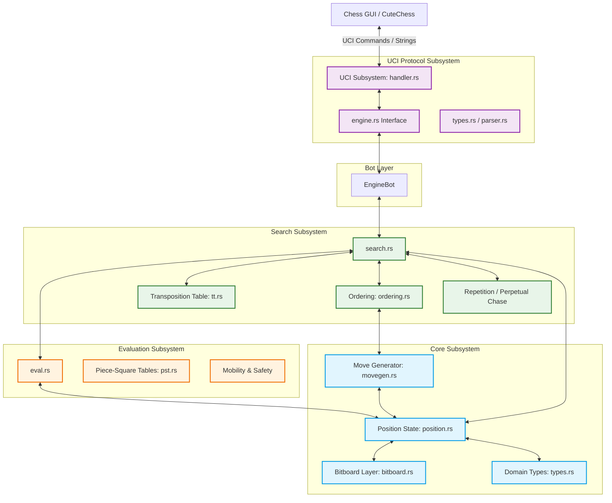

# Software Requirements Specification (SRS)
## Project: Lingine — High-Performance Xiangqi Engine in Rust

> **Target**: ~2500 ELO Xiangqi Engine  
> **Language**: Rust (edition 2021)  
> **Protocol**: UCI (with UCCI wrapper support)  
> **Inspiration**: Pikafish / Stockfish architecture adapted for the $9 \times 10$ board

---

## Table of Contents
1. [Introduction & Executive Summary](#1-introduction--executive-summary)
2. [Architectural Overview](#2-architectural-overview)
3. [Proposed Module Reorganization](#3-proposed-module-reorganization)
4. [Detailed Subsystem Specifications](#4-detailed-subsystem-specifications)
    - 4.1 [Core Rules & Board Engine (`core/`)](#41-core-rules--board-engine-core)
    - 4.2 [Search Subsystem (`search/`)](#42-search-subsystem-search)
    - 4.3 [Evaluation Subsystem (`eval/`)](#43-evaluation-subsystem-eval)
    - 4.4 [UCI Subsystem (`uci/`)](#44-uci-subsystem-uci)
5. [Non-Functional Requirements & Performance Targets](#5-non-functional-requirements--performance-targets)
6. [Design Decisions & Open Questions for User Approval](#6-design-decisions--open-questions-for-user-approval)

---

## 1. Introduction & Executive Summary

**Lingine** is a state-of-the-art Chinese Chess (Xiangqi) engine written in Rust, aiming to achieve Grandmaster-level strength (~2500 ELO). By employing modern chess engine techniques—including bitboard-accelerated move generation, transposition tables, highly selective Alpha-Beta search, and a curated evaluation function—Lingine provides a highly efficient and modular codebase.

This Software Requirements Specification (SRS) establishes the system architecture, defines a reorganized file structure, specifies algorithm configurations, and presents key design decisions to align prior work (such as the completed move generator) with the upcoming search and evaluation components.

---

## 2. Architectural Overview

The engine is divided into four cleanly decoupled subsystems:
1. **Core Board Engine (`core/`)**: Houses board representation, bitboards, FEN parser, move generation, and make/unmake move mechanisms.
2. **Search Subsystem (`search/`)**: Implements iterative deepening, Negamax Alpha-Beta search, transposition tables, and move ordering heuristics.
3. **Evaluation Subsystem (`eval/`)**: Calculates static positional values utilizing piece-square tables (PST), material balances, mobility, and safety rules.
4. **UCI Protocol Subsystem (`uci/`)**: Translates standard Universal Chess Interface (UCI) commands (e.g. `position`, `go`, `stop`) into internal engine commands.



---

## 3. Proposed Module Reorganization

To improve readability and navigate the codebase easily, we will group core Xiangqi logic inside a `core/` folder, segregate search/evaluation into distinct modules, and consolidate the fragmented files in the `uci/` module.

### Directory Structure Transition Map

| Current Path | Proposed Path | Component | Description |
|---|---|---|---|
| `src/types.rs` | `src/core/types.rs` | **Core** | Shared types (Color, Square, Move) |
| `src/bitboard.rs` | `src/core/bitboard.rs` | **Core** | `u128` bitboard definitions |
| `src/position.rs` | `src/core/position.rs` | **Core** | Board state & do_move/undo_move |
| `src/movegen/` | `src/core/movegen/` | **Core** | Move generation (attacks & tables) |
| `src/search.rs` *(new)* | `src/search/mod.rs` | **Search** | Alpha-Beta search control |
| *(planned)* | `src/search/tt.rs` | **Search** | Transposition Table (TT) |
| *(planned)* | `src/search/ordering.rs` | **Search** | MVV-LVA, killers, history sorting |
| *(planned)* | `src/search/repetition.rs` | **Search** | Perpetual check/chase detector |
| `src/eval.rs` *(new)* | `src/eval/mod.rs` | **Eval** | Evaluation entrypoint & driver |
| *(planned)* | `src/eval/material.rs` | **Eval** | Hard values & scaling adjustments |
| *(planned)* | `src/eval/pst.rs` | **Eval** | Positional tables per phase |
| *(planned)* | `src/eval/mobility.rs` | **Eval** | Safe squares and mobility metrics |
| `src/uci/mod.rs` | `src/uci/mod.rs` | **UCI** | Re-exports standard interface |
| `src/uci/engine.rs` | `src/uci/engine.rs` | **UCI** | Engine trait definition |
| `src/uci/handler.rs` | `src/uci/handler.rs` | **UCI** | Synchronous stdin-stdout processor |
| *Consolidated* | `src/uci/types.rs` | **UCI** | Merged params/responses structs |
| `src/bot/` | `src/bot/` | **Bot** | Wrapper classes (PrintBot, EngineBot) |

> [!NOTE]
> All parameters and response structs currently scattered inside `src/uci/` (e.g. `go_parameters.rs`, `register_parameters.rs`, `set_option_parameters.rs`, `responses.rs`, `move.rs`, `position.rs`) will be merged into a single clean file: `src/uci/types.rs`. This will flatten `src/uci/` from 11 files down to 4 files, significantly reducing filesystem noise.

---

## 4. Detailed Subsystem Specifications

### 4.1 Core Rules & Board Engine (`core/`)

The Core Subsystem encapsulates the state representation, validating move legality, generating moves, and applying/reverting transitions incrementally.

*   **Board Layout**: $9 \times 10$ coordinates represented as a flat array of 90 elements, coupled with piece-type and piece-color bitboards.
*   **Bitboards**: Structured as `u128` values using the lower 90 bits (indices $0 \dots 89$). Bit index is calculated as $\text{rank} \times 9 + \text{file}$.
*   **Move Encoding**: Encoded in a 16-bit `u16` representation to maintain a cache-friendly footprint:
    *   **Bits 0–6**: Destination square (0 to 89)
    *   **Bits 7–13**: Origin square (0 to 89)
    *   **Bits 14–15**: Move flags (Quiet, Capture, Check, etc.)
*   **Undo State**: Evaluated incrementally through `StateInfo` stack tracking. Avoids expensive full-board re-cloning.

#### Refactored `src/core/mod.rs` Expose Layout:
```rust
pub mod bitboard;
pub mod types;
pub mod position;
pub mod movegen;

pub use bitboard::Bitboard;
pub use types::{Color, Square, Rank, File, Piece, PieceType, Move, MoveList, Value, Key};
pub use position::Position;
```

---

### 4.2 Search Subsystem (`search/`)

The Search engine utilizes a selective iterative-deepening depth search optimized with modern pruning heuristics to isolate high-value tactical branches.

*   **Framework**: Fail-soft Negamax with Alpha-Beta pruning.
*   **Quiescence Search**: Evaluates quiet capture sequences to resolve tactical tension and avoid the horizon effect.
*   **Iterative Deepening**: Progresses depth incrementally (1, 2, 3, etc.) allowing stable move prediction and robust time management.
*   **Pruning & Reduction Heuristics**:
    *   **Null Move Pruning (NMP)**: Detects high-advantage nodes by performing a shallow search after passing the turn.
    *   **Late Move Reductions (LMR)**: Performs shallow-depth searches on moves ordered late in the list.
    *   **Aspiration Windows**: Minimizes alpha-beta bounds around the prior iteration's score to limit search space.
*   **Move Ordering Pipeline**: Maximizes search speed by triggering quick beta-cutoffs:
    1.  **Transposition Table (TT) Move**: Highest priority.
    2.  **Captures via MVV-LVA**: Most Valuable Victim / Least Valuable Attacker.
    3.  **Killer Moves**: Quiet moves that caused beta-cutoffs in sibling branches.
    4.  **History Heuristic**: Dynamic weights assigned to moves based on historical cutoffs.
*   **Transposition Table (TT)**:
    *   Keyed by a 64-bit Zobrist key.
    *   Stores `score`, `depth`, `bound` (Exact, LowerBound, UpperBound), and `best_move`.
    *   Replacement scheme: Two-tier or depth-preferred bucket replacement with aging.

---

### 4.3 Evaluation Subsystem (`eval/`)

Evaluation maps a static board state to a score in centipawns (from White/Red's perspective). To hit the ~2500 ELO target, a hybrid static + incremental evaluation model will be implemented.

*   **Incremental Evaluation**: The board state maintains a running score of piece material and positional Piece-Square Tables (PST). When `do_move` is called, the positional score is adjusted incrementally via XOR/add/sub, avoiding full board loops.
*   **Static Positional Tables**: Distinct PSTs mapped per piece type, color, and game phase (Opening vs. Endgame).
*   **Material Base Values (Eleeye Bootstrap)**:
    *   Rook: 600
    *   Cannon: 285
    *   Horse: 270
    *   Elephant / Advisor: 120 / 110
    *   Pawn: 30 (opening) $\to$ 70 (advanced, crossed river)
*   **Advanced Positional Heuristics**:
    *   **Mobility**: Reward sliding pieces based on the number of legal, safe squares they control.
    *   **Pawn Structure**: Reward crossed-river pawns, penalize isolated pawns, and reward pawns controlling files.
    *   **King Safety**: Penalize exposure of the King in the palace, reward intact Advisor-Elephant structures (the defensive shield).
    *   **Cannon Platforms**: Reward Cannons aligned with a single intervening piece (the platform) pointing at vulnerable enemy pieces.

---

### 4.4 UCI Subsystem (`uci/`)

The protocol interface handles standard GUI communication commands.

*   **Flattener**: Flattens sub-files into `uci/types.rs` to clean up the module structure.
*   **Time Management**: Decodes search constraints (`wtime`, `btime`, `winc`, `binc`, `movetime`, `depth`) and allocates optimal search times.
*   **Signals**: Handles async abort commands via `GoParameters::stop` thread indicators.

---

## 5. Non-Functional Requirements & Performance Targets

*   **Safety & Core Correctness**: Zero unsafe code blocks in core rule files. 100% of custom bitwise operations covered by unit and perft verification tests.
*   **Search Speed (NPS)**: Target search processing speed $> 1,000,000$ Nodes Per Second (NPS) on modern multi-core x86 CPUs.
*   **Memory Overhead**: Limit Transposition Table memory consumption to a user-defined threshold (default 64MB, configurable up to 2GB) without dynamic allocations during search.
*   **Concurrency**: Phase 1-3 single-threaded search. Phase 4 transition to **Lazy SMP** parallel thread execution with lock-free shared TT.

---

## 6. Design Decisions & Open Questions for User Approval

Before initiating refactoring and starting development of search and evaluation, we must align on several critical design parameters.

### Decision 1: Folder Restructuring (Core, Search, Eval, UCI)
> [!IMPORTANT]
> **Proposed Action**: Reorganize the code layout as detailed in Section 3, shifting `types.rs`, `bitboard.rs`, `position.rs`, and `movegen` to a `core/` folder. At the same time, collapse `src/uci/`'s auxiliary structures into `src/uci/types.rs` to flatten the interface module.
*   **Option A**: Proceed with the full proposed restructuring immediately. (Recommended)
*   **Option B**: Postpone reorganization until after the basic Search & Eval (Iteration 1) are complete.

### Decision 2: Stabilize Rust Compiler Requirements (Nightly vs. Stable)
> [!WARNING]
> Currently, move generation relies on `#![feature(min_adt_const_params)]` which restricts the engine to Nightly Rust.
*   **Option A**: Keep the nightly constraint. It allows clean enum-based generic dispatch for the 7 piece types.
*   **Option B**: Refactor the const-generic enum parameters to standard integer parameters or standard functions. This will allow Lingine to compile on Stable Rust, enhancing usability for users and package managers. (Recommended)

### Decision 3: Perpetual Check & Repetition Rules Implementation
> [!IMPORTANT]
> Xiangqi rules enforce complex and asymmetric repetition penalties. Perpetual checking or perpetual chasing is strictly forbidden. The side triggering the perpetual check must change their move or forfeit, while standard non-perpetual repetitions are declared a draw.
*   **Option A**: Standard Draw-On-Repetition (easy to write, common in basic chess engines, but leads to illegal draws in Xiangqi).
*   **Option B**: Asymmetric Repetition Scoring. Identify check/chase attackers during repetition searches using a history ply list. If a repeating sequence constitutes a perpetual check/chase, return a heavy penalty (negative mate score, e.g. `-MATE + ply`) for the attacker and a win score for the defender. (Recommended)

### Decision 4: UCI vs. UCCI Protocol Wrapper Design
> [!NOTE]
> Cutechess and global testing environments natively utilize UCI for Xiangqi, but Chinese desktop GUIs (such as CCBridge, Eleeye, XQWizard) exclusively speak UCCI.
*   **Option A**: Keep standard UCI only.
*   **Option B**: Build a dual-protocol parser in `src/uci/handler.rs` that automatically detects if the GUI is sending UCI or UCCI commands, adjusting move formats (e.g. `a0b1` vs `h9e7` / algebraic) and startup handshakes. (Recommended)
*   **Option C**: Keep the engine code strictly UCI-only, and provide a tiny, separate Rust adapter executable `lingine-ucci` that wraps the engine.

### Decision 5: Transposition Table (TT) Strategy & Footprint
*   **Option A**: Single large lockless TT array with aging bits, utilizing a two-tier replacement strategy (depth-preferred slot + always-replace slot in each bucket). (Recommended)
*   **Option B**: Standard HashMap protected by read-write locks (simpler but high contention under multithreading).

### Decision 6: Incremental Positional Scoring Strategy
*   **Option A**: Full incremental evaluation. Both Material and PST values are updated inside `Position::do_move` and `Position::undo_move`. Static evaluation will simply read the cached value from `Position` and apply minor heuristics (mobility, shields). This is extremely fast but requires careful synchronization during development to prevent bugs. (Recommended)
*   **Option B**: Compute material and PST from scratch in the evaluation function on every search leaf node. This is simpler to write and debug but significantly slower (reduces NPS by 30-50%).
